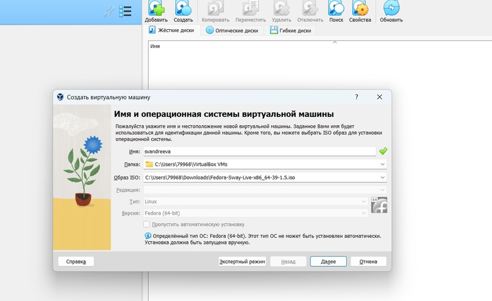
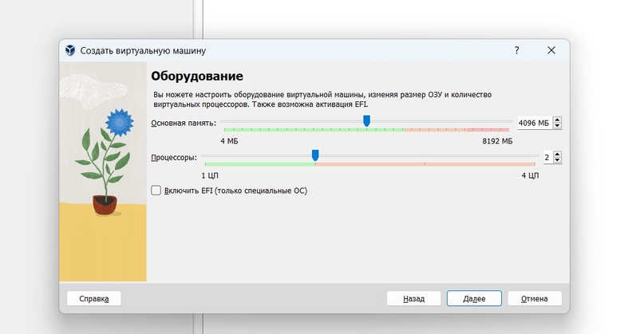
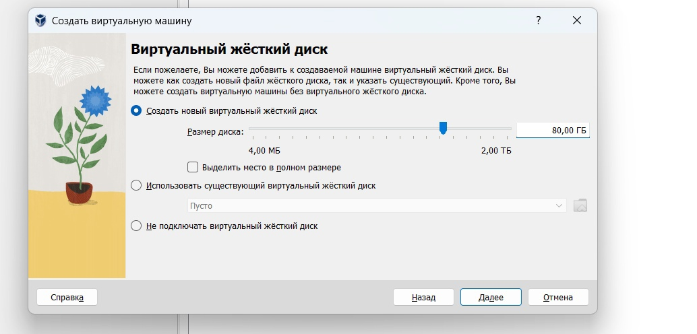
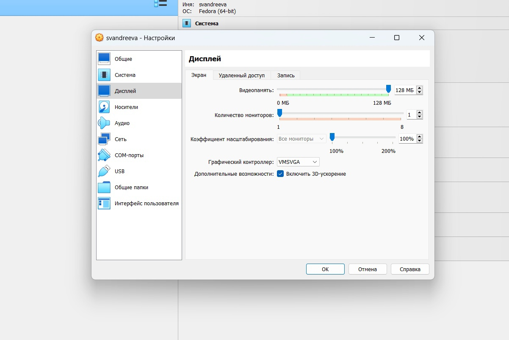
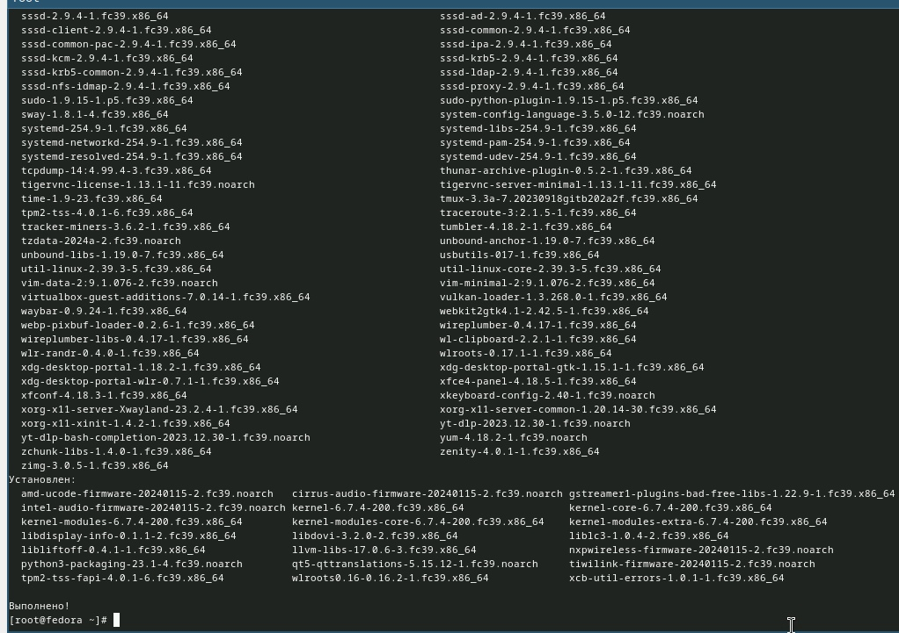
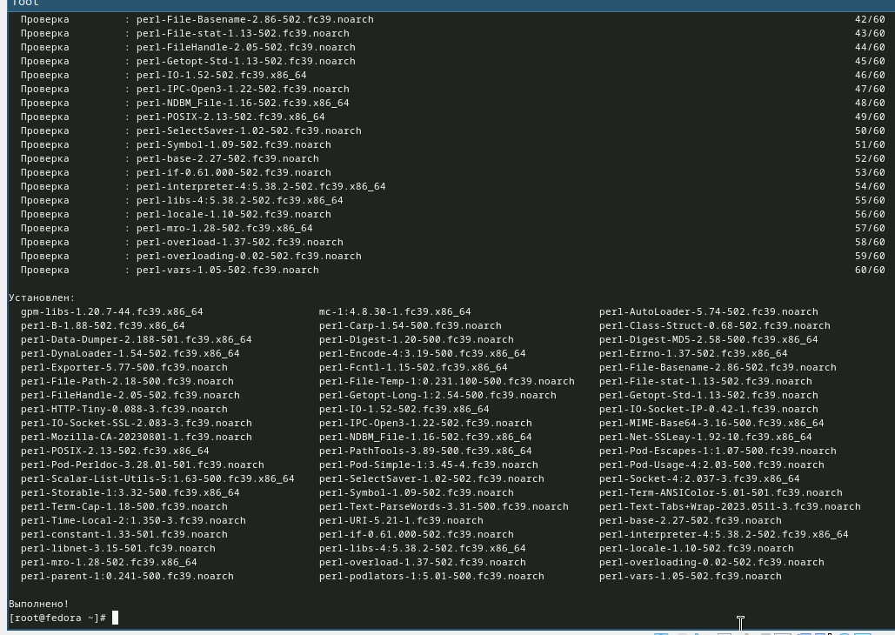
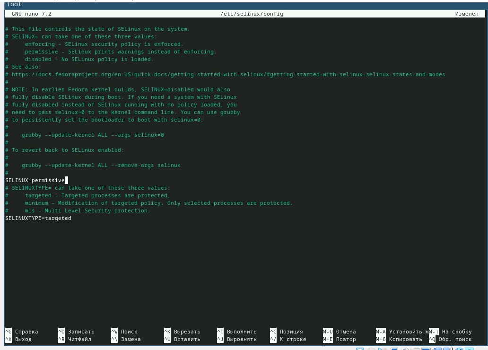
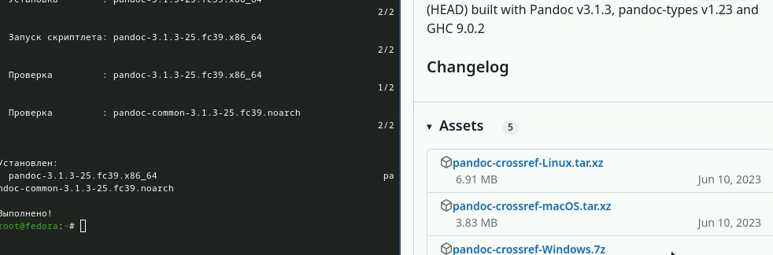
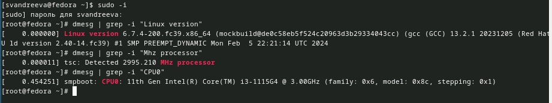
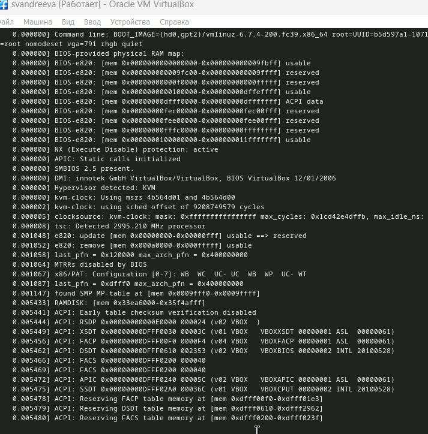

---
## Front matter
lang: ru-RU
title: "Лабораторная работа №1. Установка ОС Linux" 
subtitle: "Дисциплина: Операционные системы"
author:
  - Андреева С.В.
institute:
  - Группа НПИбд-01-23
  - Российский университет дружбы народов, Москва, Россия

## i18n babel
babel-lang: russian
babel-otherlangs: english

## Formatting pdf
toc: false
toc-title: Содержание
slide_level: 2
aspectratio: 169
section-titles: true
theme: metropolis
header-includes:
 - \metroset{progressbar=frametitle,sectionpage=progressbar,numbering=fraction}
 - '\makeatletter'
 - '\beamer@ignorenonframefalse'
 - '\makeatother'

## Fonts
mainfont: PT Serif
romanfont: PT Serif
sansfont: PT Sans
monofont: PT Mono
mainfontoptions: Ligatures=TeX
romanfontoptions: Ligatures=TeX
sansfontoptions: Ligatures=TeX,Scale=MatchLowercase
monofontoptions: Scale=MatchLowercase,Scale=0.9
---

# Информация

## Докладчик

:::::::::::::: {.columns align=center}
::: {.column width="70%"}

  * Андреева Софья Владимировна
  * Группа НПИбд-01-23
  * Российский университет дружбы народов
  * [Ссылка на репозиторий GitHub](https://github.com/svandreeva/study_2023-2024_os-intro.git) 

:::
::: {.column width="30%"}

:::
::::::::::::::

# Вводная часть

## Цели и задачи

- Целью данной работы является приобретение практических навыков установки операционной системы на виртуальную машину, настройки минимально необходимых для дальнейшей работы сервисов.

# Выполнение лабораторной работы

## Настройка виртуальной машины

{#fig:001 width=70%} 

## Настройка виртуальной машины

{#fig:002 width=70%} 

## Настройка виртуальной машины

{#fig:003 width=70%} 

## Настройка виртуальной машины

{#fig:004 width=70%} 

## Настройка виртуальной машины

{#fig:005 width=70%} 

## Настройка виртуальной машины

Обновляем все пакеты dnf -y update.

{#fig:006 width=70%}

## Настройка виртуальной машины

Установим программы для удобства работы в консоли. Автоматическое обновление я не установила, так как не вижу в нем необходимости

{#fig:007 width=70%}

## Настройка виртуальной машины

Отключаем SELinux.Меняем значения в файле /etc/selinux/config.Перезагружаем виртуальную машину.

{#fig:008 width=70%}

## Настройка виртуальной машины

Установим драйвера для VirtualBox. Устанавливаем средства разработки.Установим пакет DKMS.В меню виртуальной машины подключим образ диска дополнений гостевой ОС. Подмонтируем диск. Установим драйвера и перезагрузим машину.

{#fig:009 width=70%}

## Настройка виртуальной машины

Настроим раскладки клавиатуры.

{#fig:010 width=70%}

## Подключение общей папки

Подключение общей папки.Внутри виртуальной машины добавим своего пользователя в группу vboxsf, а затем в хостовой системе подключим разделяемую папку. Перезагрузим машину.

{#fig:011 width=70%}

## Установка программного обеспечения для создания документации

Установим pandoc с помощью менеджера пакетов, а затем установим пакет pandoc-crossref той же версии.Распакуем загрузки и поместим их в каталог /usr/local/bin.Установим дистрибутив TeXlive.

{#fig:012 width=70%}

## Домашнее задание 

{#fig:013 width=70%}

## Домашнее задание 

{#fig:014 width=70%}

## Вывод

 Я приобрела практические навыки установки операционной системы на виртуальную машину, настройки минимально необходимых для дальнейшей работы сервисов. 
