---
## Front matter
title: "Отчёт по лабораторной работе №1"
subtitle: "Операционные системы"
author: "Андреева Софья Владимировна"

## Generic otions
lang: ru-RU
toc-title: "Содержание"

## Bibliography
bibliography: bib/cite.bib
csl: pandoc/csl/gost-r-7-0-5-2008-numeric.csl

## Pdf output format
toc: true # Table of contents
toc-depth: 2
lof: true # List of figures
fontsize: 12pt
linestretch: 1.5
papersize: a4
documentclass: scrreprt
## I18n polyglossia
polyglossia-lang:
name: russian
options:
- spelling=modern
- babelshorthands=true
polyglossia-otherlangs:
name: english
## I18n babel
babel-lang: russian
babel-otherlangs: english
## Fonts
mainfont: PT Serif
romanfont: PT Serif
sansfont: PT Sans
monofont: PT Mono
mainfontoptions: Ligatures=TeX
romanfontoptions: Ligatures=TeX
sansfontoptions: Ligatures=TeX,Scale=MatchLowercase
monofontoptions: Scale=MatchLowercase,Scale=0.9
## Biblatex
biblatex: true
biblio-style: "gost-numeric"
biblatexoptions:
- parentracker=true
- backend=biber
- hyperref=auto
- language=auto
- autolang=other*
- citestyle=gost-numeric
## Pandoc-crossref LaTeX customization
figureTitle: "Рис."
tableTitle: "Таблица"
listingTitle: "Листинг"
lofTitle: "Список иллюстраций"
lolTitle: "Листинги"
## Misc options
indent: true
header-includes:
- \usepackage{indentfirst}
- \usepackage{float} # keep figures where there are in the text
- \floatplacement{figure}{H} # keep figures where there are in the text
---

# Цель работы

Целью данной работы является приобретение практических навыков установки операционной системы на виртуальную машину, настройки минимально необходимых для дальнейшей работы сервисов.

# Выполнение работы

Скачаем образ ISO проведем настройки виртуальной машины, создадим виртуальный жесткий диск (рис. @fig:001),(рис. @fig:002),(рис. @fig:003),(рис. @fig:004).

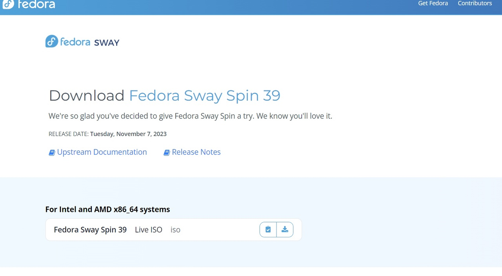{#fig:001 width=70%}

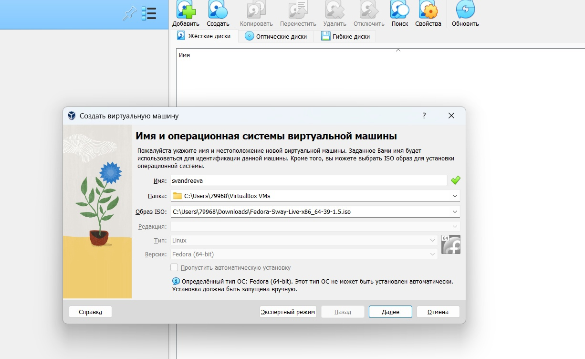{#fig:002 width=70%}

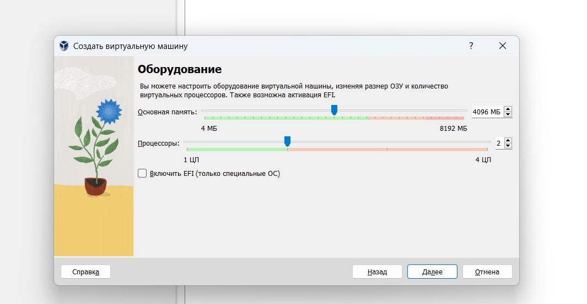{#fig:003 width=70%}

{#fig:004 width=70%}

После создания виртуальной машины, вынимаем диск и настраиваем дисплей  (рис. @fig:005),  (рис. @fig:006).

{#fig:005 width=70%}

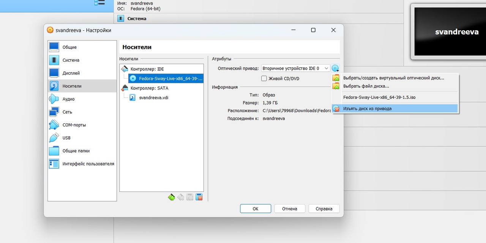{#fig:006 width=70%}

Обновляем все пакеты dnf -y update (рис. @fig:007).

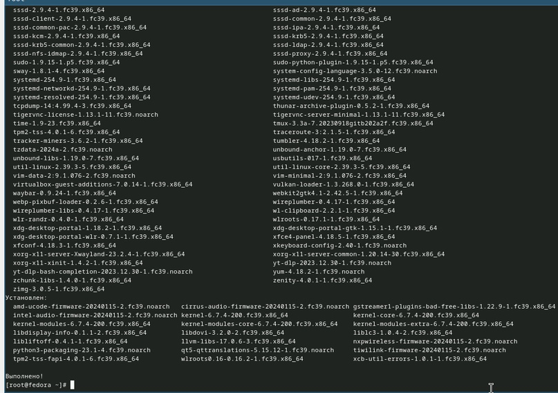{#fig:007 width=70%}
 
Установим программы для удобства работы в консоли. Автоматическое обновление я не установила, так как не вижу в нем необходимости. (рис. @fig:008).

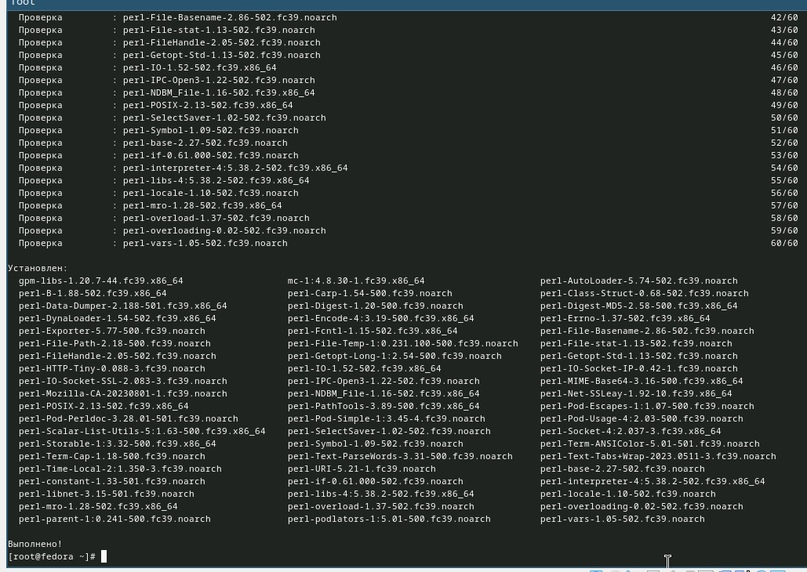{#fig:008 width=70%}

Отключаем SELinux.Меняем значения в файле /etc/selinux/config.Перегружаем виртуальную машину(рис.@fig:009).

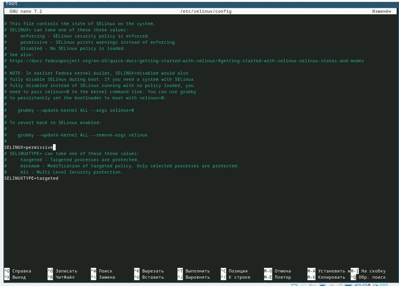{#fig:009 width=70%}

Установим драйвера для VirtualBox. Устанавливаем средства разработки. (рис. @fig:010).

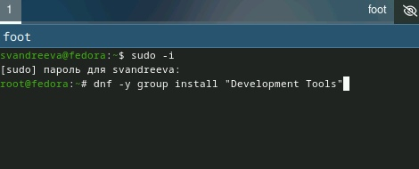{#fig:010 width=70%}

Установим пакет DKMS (рис. @fig:011).

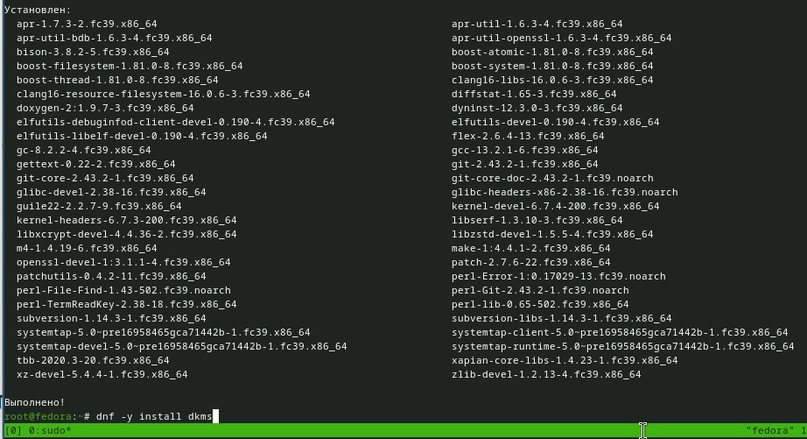{#fig:011 width=70%}

В меню виртуальной машины подключим образ диска дополнений гостевой ОС. Подмонтируем диск. Установим драйвера и перезагрузим машину. (рис. @fig:012).

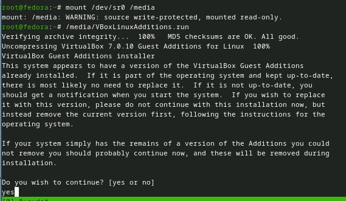{#fig:012 width=70%}

Настроим раскладки клавиатуры.Создадим конфигурационный файл (рис. @fig:013).

{#fig:013 width=70%}

Отредактируем конфигурационный файл ~/.config/sway/config.d/95-system-keyboard-config.conf.(рис. @fig:014)

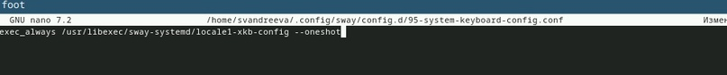{#fig:014 width=70%}

Отредактируем конфигурационный файл /etc/X11/xorg.conf.d/00-keyboard.conf.Перезагрузим машину (рис. @fig:015).

![Отредактируем  конфигурационный файл]](image/15.jpg){#fig:015 width=70%}

Подключение общей папки.Внутри виртуальной машины добавим своего пользователя в группу vboxsf, а затем в хостовой системе подключим разделяемую папку. Перезагрузим машину (рис. @fig:016).

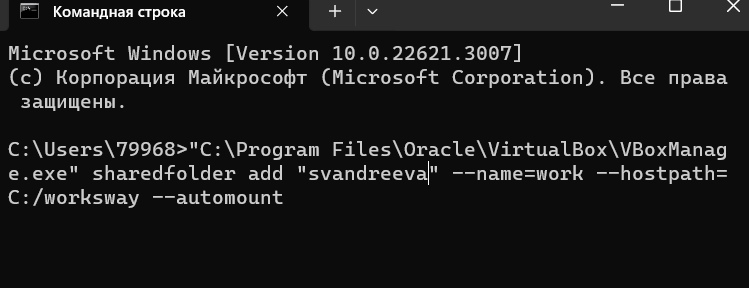{#fig:016 width=70%}

Установка программного обеспечения для создания документации. Установим pandoc с помощью менеджера пакетов, а затем установим пакет pandoc-crossref той же версии (рис. @fig:017)

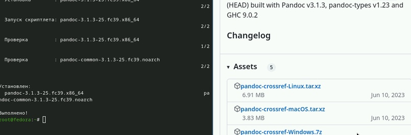{#fig:017 width=70%}

Распакуем загрузки и поместим их в каталог /usr/local/bin (рис. @fig:018).

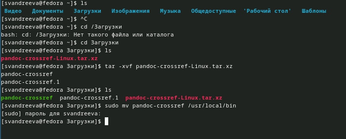{#fig:018 width=70%}

Установим дистрибутив TeXlive (рис. @fig:019), (рис. @fig:020).

{#fig:019 width=70%}

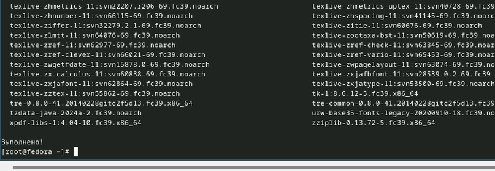{#fig:020 width=70%}

# Задание для самостоятельной работы.

В окне терминала проанализируем последовательность загрузки системы, выполнив команду dmesg.(рис. @fig:021).

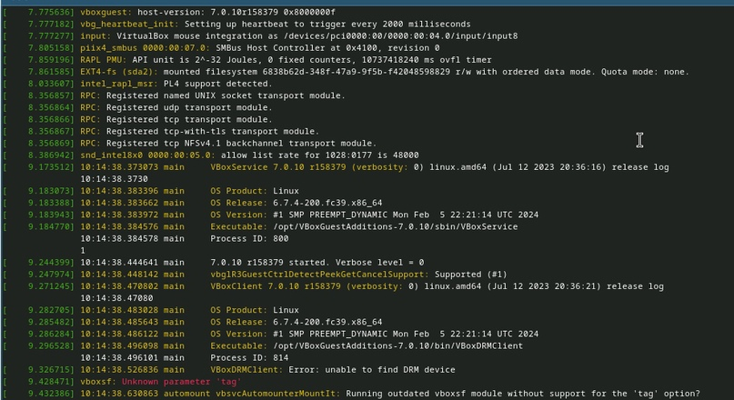{#fig:021 width=70%}

Получим следующую информацию: версия ядра Linux, частота процессора, модель процессора. (рис. @fig:022).

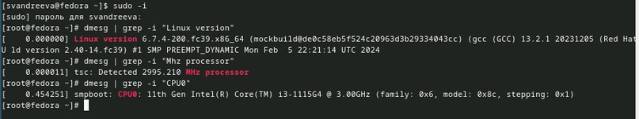{#fig:022 width=70%}

Объём доступной оперативной памяти (рис. @fig:023).

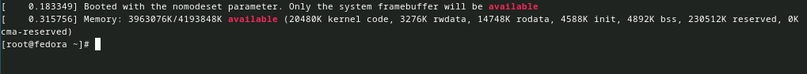{#fig:023 width=70%}

Тип обнаруженного гипервизора и тип файловой системы корневого раздела. (рис. @fig:024).

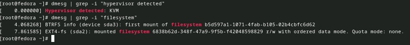{#fig:024 width=70%}

Последовательность монтирования файловых систем (рис. @fig:025).

{#fig:025 width=70%}

# Контрольные вопросы.

1) Какую информацию содержит учётная запись пользователя?
Учетная запись пользователя содержит информацию по авторизации - учётные данные. Это индетификатор для подключения к системе. То есть, это:
- Системное имя - должно быть уникальным, содержит только латинские знаки.
- Уникальных идентификатор пользователя в системе, содержит число.
- Полное имя - ФИО пользователя.

2) Укажите команды терминала и приведите примеры:
- для получения справки по команде = —help;
- для перемещения по файловой системе = cd;
- для просмотра содержимого каталога = ls;
- для определения объёма каталога = du + имя каталога;
- для создания / удаления каталогов = mkdir/rmdir;
- для создания / удаления файлов = touch/rm;
- для задания определённых прав на файл / каталог = chmod;
- для просмотра истории команд = history;

3) Что такое файловая система? Приведите примеры с краткой характеристикой.
Это способ хранения, организации и именования данных на различных носителях.
Примеры:
- FAT32 - файловая система, в которой пространство разделено на три части: область служебных структур, указатели в виде таблиц и область хранения файлов;
- ext4 - система, которая используется в основном в ОС на Linux. Журналируемая файловая система, в послдней версии максимальный размер файла - 16Гб.

4) Как посмотреть, какие файловые системы подмонтированы в ОС?
Для этого нужно ввести в терминал команду df - это покажет список всех файловых систем по номерам устройств, размеры и данные о памяти. Но при этом можно посмотреть в свойствах папок все эти данные вручную.

5) Как удалить зависший процесс?
- killall - остановит все процессы, которые есть в данный момент.
- kill + id-процесса. Это поможет удалить один конкретный процесс. (Чтобы узнать id нужно написать в терминале команду ps).

# Выводы

Я приобрела практические навыки установки операционной системы на виртуальную машину, настройки минимально необходимых для дальнейшей работы сервисов.
