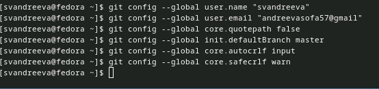
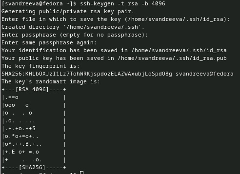
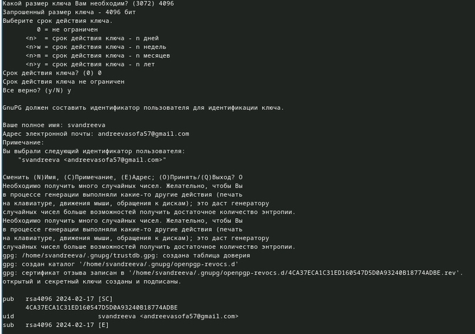
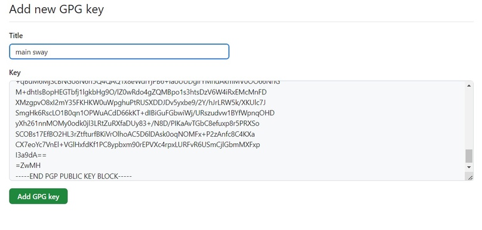
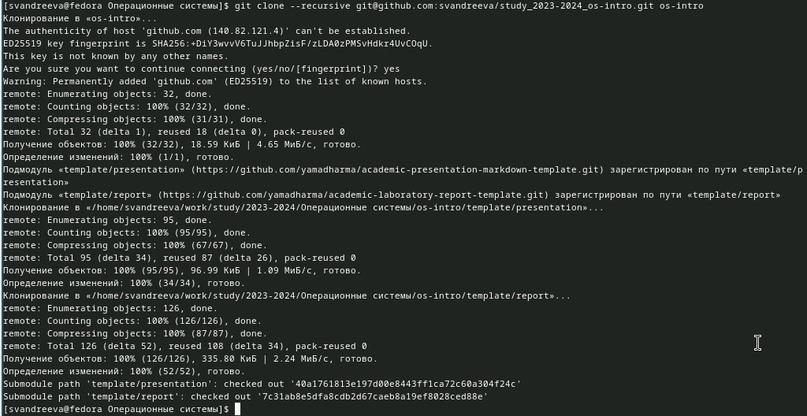
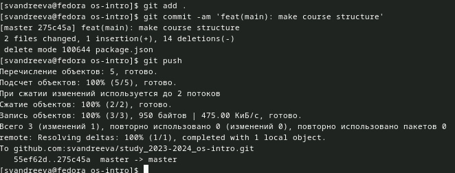

---
## Front matter
lang: ru-RU
title: "Лабораторная работа №2."
subtitle: "Дисциплина: Операционные системы"
author:
- Андреева С.В.
institute:
- Группа НПИбд-01-23
- Российский университет дружбы народов, Москва, Россия

## i18n babel
babel-lang: russian
babel-otherlangs: english

## Formatting pdf
toc: false
toc-title: Содержание
slide_level: 2
aspectratio: 169
section-titles: true
theme: metropolis
header-includes:
- \metroset{progressbar=frametitle,sectionpage=progressbar,numbering=fraction}
- '\makeatletter'
- '\beamer@ignorenonframefalse'
- '\makeatother'

## Fonts
mainfont: PT Serif
romanfont: PT Serif
sansfont: PT Sans
monofont: PT Mono
mainfontoptions: Ligatures=TeX
romanfontoptions: Ligatures=TeX
sansfontoptions: Ligatures=TeX,Scale=MatchLowercase
monofontoptions: Scale=MatchLowercase,Scale=0.9
---

# Информация

## Докладчик

:::::::::::::: {.columns align=center}
::: {.column width="70%"}

* Андреева Софья Владимировна
* Группа НПИбд-01-23
* Российский университет дружбы народов
* [Ссылка на репозиторий GitHub](https://github.com/svandreeva/study_2023-2024_os-intro.git)

:::
::: {.column width="30%"}

:::
::::::::::::::

# Вводная часть

## Цели и задачи

- Изучить идеологию и применение средств контроля версий.
- Освоить умения по работе с git.

# Выполнение лабораторной работы

## Установим git:

{#fig:001 width=70%}

## Установим gh

{#fig:002 width=70%}

## Проведем базовую настройку git

Проведем базовую настройку git.Зададим имя и email владельца репозитория, настроим utf-8 в выводе сообщений git, зададим имя начальной ветки, параметр autocrlf и safecrlf

{#fig:003 width=70%}

## Создадим ключи ssh

Создадим ключи ssh: по алгоритму rsa с ключом размером 4096 бит.И по алгоритму ed25519.

{#fig:004 width=70%}

## Создадим ключи pgp

Создадим ключи pgp.Генерируем ключ, указав его тип, размер, срок действия.

{#fig:005 width=70%}

## добавляем PGP ключ в GitHub

добавляем PGP ключ в GitHub, для этого выводим список ключей и копируем отпечаток приватного ключа.Затем копируем наш сгенерированный PGP ключ в буфер обмена и вставляем его при создании New GPG key в GitHub.

{#fig:006 width=65%}

## Настройка gh

Настройка gh.Для начала авторизуемся, ответив на несколько наводящих вопросов.

{#fig:007 width=60%}

## Клонируем репозиторий

Создадим репозиторий, предварительно создав рабочее пространство.Клонируем репозиторий.

{#fig:008 width=55%}

## Отправим файлы на сервер

Перейдем в каталог курса, удалим лишние файлы и создадим необходимые каталоги.Отправим файлы на сервер

{#fig:009 width=70%}

## Вывод

Я изучила идеологию и применение средств контроля версий.
Освоила умения по работе с git.
