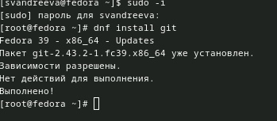
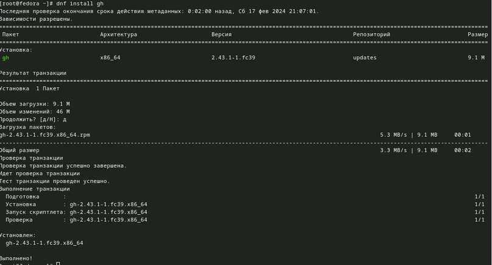
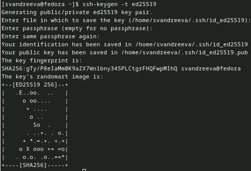
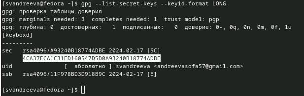
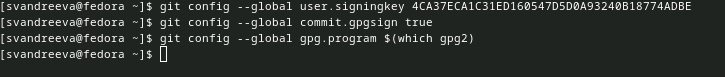
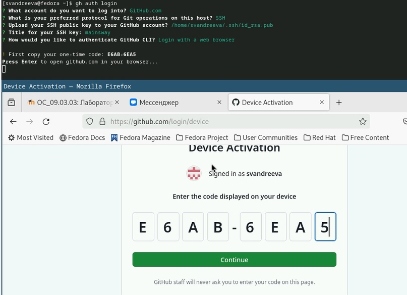
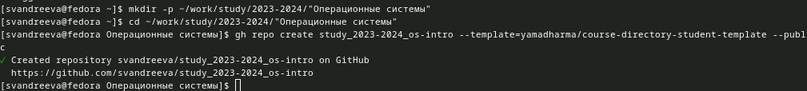
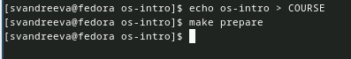

---
## Front matter
title: "Отчёт по лабораторной работе №2"
subtitle: "Операционные системы"
author: "Андреева Софья Владимировна"

## Generic otions
lang: ru-RU
toc-title: "Содержание"

## Bibliography
bibliography: bib/cite.bib
csl: pandoc/csl/gost-r-7-0-5-2008-numeric.csl

## Pdf output format
toc: true # Table of contents
toc-depth: 2
lof: true # List of figures
fontsize: 12pt
linestretch: 1.5
papersize: a4
documentclass: scrreprt
## I18n polyglossia
polyglossia-lang:
name: russian
options:
- spelling=modern
- babelshorthands=true
polyglossia-otherlangs:
name: english
## I18n babel
babel-lang: russian
babel-otherlangs: english
## Fonts
mainfont: PT Serif
romanfont: PT Serif
sansfont: PT Sans
monofont: PT Mono
mainfontoptions: Ligatures=TeX
romanfontoptions: Ligatures=TeX
sansfontoptions: Ligatures=TeX,Scale=MatchLowercase
monofontoptions: Scale=MatchLowercase,Scale=0.9
## Biblatex
biblatex: true
biblio-style: "gost-numeric"
biblatexoptions:
- parentracker=true
- backend=biber
- hyperref=auto
- language=auto
- autolang=other*
- citestyle=gost-numeric
## Pandoc-crossref LaTeX customization
figureTitle: "Рис."
tableTitle: "Таблица"
listingTitle: "Листинг"
lofTitle: "Список иллюстраций"
lolTitle: "Листинги"
## Misc options
indent: true
header-includes:
- \usepackage{indentfirst}
- \usepackage{float} # keep figures where there are in the text
- \floatplacement{figure}{H} # keep figures where there are in the text
---

# Цель работы

Изучить идеологию и применение средств контроля версий.Освоить умения по работе с git.

# Выполнение работы

Установим git (рис. @fig:001).

{#fig:001 width=70%}

Установим gh (рис. @fig:002).

{#fig:002 width=70%}

Проведем базовую настройку git.Зададим имя и email владельца репозитория, настроим utf-8 в выводе сообщений git, зададим имя начальной ветки, параметр autocrlf и safecrlf (рис. @fig:003).

{#fig:003 width=70%}

Создадим ключи ssh: по алгоритму rsa с ключом размером 4096 бит (рис. @fig:004).

{#fig:004 width=70%}

И по алгоритму ed25519 (рис. @fig:005).

{#fig:005 width=70%}

Создадим ключи pgp.Генерируем ключ, указав его тип, размер, срок действия (рис. @fig:006).

{#fig:006 width=70%}

У меня уже есть учетная запись в github, поэтому следующим шагом мы добавляем PGP ключ в GitHub, для этого выводим список ключей и копируем отпечаток приватного ключа. (рис. @fig:007).

{#fig:007 width=70%}

Затем копируем наш сгенерированный PGP ключ в буфер обмена и вставляем его при создании New GPG key в GitHub. (рис. @fig:008).

{#fig:008 width=70%}

Используя введёный email, укажем Git применять его при подписи коммитов(рис.@fig:009).

{#fig:009 width=70%}

Настройка gh.Для начала авторизуемся, ответив на несколько наводящих вопросов. (рис. @fig:010).

{#fig:010 width=70%}

Создадим репозиторий, предварительно создав рабочее пространство (рис. @fig:011).

{#fig:011 width=70%}

Клонируем репозиторий (рис. @fig:012).

{#fig:012 width=70%}

Перейдем в каталог курса, удалим лишние файлы и создадим необходимые каталоги(рис. @fig:013).

{#fig:013 width=70%}

Отправим файлы на сервер (рис. @fig:014).

{#fig:014 width=70%}

# Контрольные вопросы.

1. Системы контроля версий (VCS) разработаны специально для того, чтобы максимально упростить и упорядочить работу над проектом (вне зависимости от того, сколько человек в этом участвуют). СКВ дает возможность видеть, кто, когда и какие изменения вносил; позволяет формировать новые ветви проекта, объединять уже имеющиеся; настраивать контроль доступа к проекту; осуществлять откат до предыдущих версий.

2. Основные понятия:

- Хранилище (repository, сокр. repo), или репозитарий, — место хранения всех версий и служебной информации;
- Коммит (commit) — 1) синоним версии; 2) создание новой версии («сделать коммит», «закоммитить»);
- История разработки — совокупность всех версий файлов, над которыми ведется работа. Историей разработки в данном случае будет список изменений: создание файла, добавление изначального текста, исправление опечатки, добавление нового текста, объединение двух версий файла (при выполнении слияния);
- Рабочая копия (working copy или working tree) — текущее состояние файлов проекта, основанное на версии из хранилища (обычно на последней).

3. Централизованные и децентрализованные VCS:

- Централизованные VCS - одно основное хранилище всего проекта, где каждый пользователь копирует себе необходимые ему файлы из этого репозитория, изменяет и, затем, добавляет свои изменения обратно. Например Subversion, CVS, TFS, VAULT, AccuRev;

- Децентрализованные VCS - у каждого пользователя свой вариант (возможно не один) репозитория, присутствует возможность добавлять и забирать изменения из любого репозитория. Например Git, Mercurial, Bazaar.

4. Единоличная работа с хранилищем:

- работа в локальном репозитории;
- сохранение изменений и загрузка на серверов.

5. Работа с общим хранилищем VCS:

- проверка обновлений;
- загрузка обновлений (при наличии);
- работа в локальном репозитории;
- создаются ветвления, если несколько пользователей работают над одним и тем же файлом/документом;
- по результатам различных версий могут происходить слияния в одну ветвь.

6. Основные задачи, решаемые инструментальным средством git:

- хранить информацию о всех изменениях в коде;
- обеспечение удобства командной работы над кодом.

7. Примеры команд git:

- git pull - получение обновлений (изменений) текущего дерева из центрального репозитория;
- git push - отправка всех произведённых изменений локального дерева в центральный репозиторий;
- git status - просмотр списка изменённых файлов в текущей директории;
- git add - добавить все изменённые и/или созданные файлы и/или каталоги;
- git commit -am 'Описание коммита' - сохранить все добавленные изменения и все изменённые файлы.

8. Примеры команд для работы с локальным и удалённым репозиториями
git push -all (push origin master/любой branch)

9. Ветка (англ. branch) — это последовательность коммитов, в которой ведётся параллельная разработка какого-либо функционала. Основная ветка – master. Ветки нужны, чтобы несколько программистов могли вести работу над одним и тем же проектом или даже файлом одновременно, при этом не мешая друг другу. Кроме того, ветки используются для тестирования экспериментальных функций: чтобы не повредить основному проекту, создается новая ветка специально для экспериментов.

10. Для игнорирования некоторых файлов можно создать файл .gitignore в корневом каталоге репозитория, чтобы сообщить Git, какие файлы и каталоги следует игнорировать при фиксации. Иногда имеется группа файлов, которые не нужно автоматически добавлять в репозиторий. К таким файлам обычно относятся автоматически генерируемые файлы (различные логи, результаты сборки программ и т. п.)

# Выводы

Я изучила идеологию и применение средств контроля версий.Освоила умения по работе с git.
