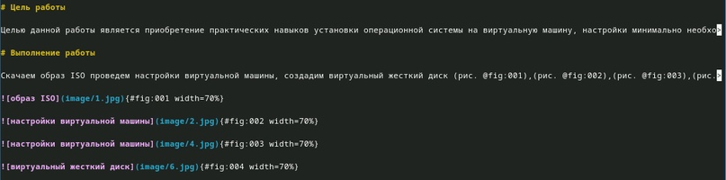
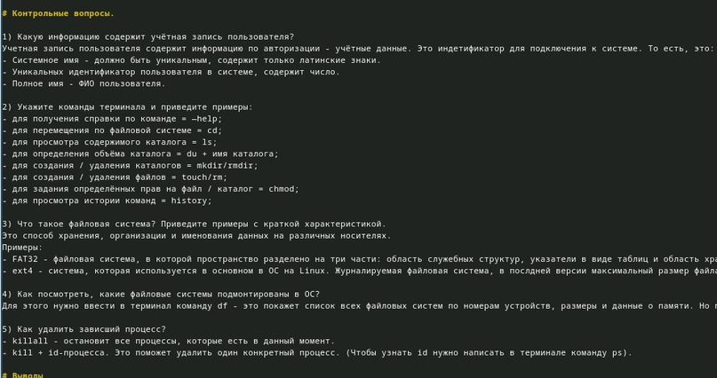
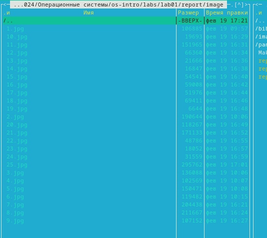
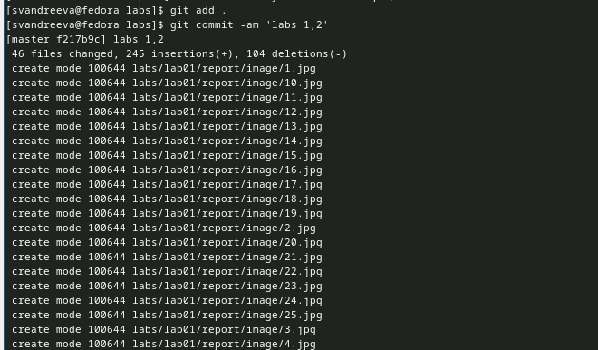

---
## Front matter
lang: ru-RU
title: "Лабораторная работа №3."
subtitle: "Дисциплина: Операционные системы"
author:
- Андреева С.В.
institute:
- Группа НПИбд-01-23
- Российский университет дружбы народов, Москва, Россия

## i18n babel
babel-lang: russian
babel-otherlangs: english

## Formatting pdf
toc: false
toc-title: Содержание
slide_level: 2
aspectratio: 169
section-titles: true
theme: metropolis
header-includes:
- \metroset{progressbar=frametitle,sectionpage=progressbar,numbering=fraction}
- '\makeatletter'
- '\beamer@ignorenonframefalse'
- '\makeatother'

## Fonts
mainfont: PT Serif
romanfont: PT Serif
sansfont: PT Sans
monofont: PT Mono
mainfontoptions: Ligatures=TeX
romanfontoptions: Ligatures=TeX
sansfontoptions: Ligatures=TeX,Scale=MatchLowercase
monofontoptions: Scale=MatchLowercase,Scale=0.9
---

# Информация

## Докладчик

:::::::::::::: {.columns align=center}
::: {.column width="70%"}

* Андреева Софья Владимировна
* Группа НПИбд-01-23
* Российский университет дружбы народов
* [Ссылка на репозиторий GitHub](https://github.com/svandreeva/study_2023-2024_os-intro.git)

:::
::: {.column width="30%"}

:::
::::::::::::::

# Вводная часть

## Цели и задачи

- Целью данной работы является приобретение навыков оформления отчётов с помощью легковесного языка разметки Markdown.

# Выполнение лабораторной работы

## Оформление шапки

{#fig:001 width=70%}

## Оформление заголовков

{#fig:002 width=70%}

## Cозданиe неупорядоченного списка  

Для создания неупорядоченного списка можно использовать зведочки или тире, для упорядоченного - соответствующие цифры.Для многоуровневых списков можно использовать отступы.

{#fig:003 width=60%}

## Оформляем изображения

Оформляем изображения.

{#fig:004 width=70%}

## Все изображения

Все изображения, сделанные во время выполнения лабораторной работы сохраняются в специальную папку.

{#fig:006 width=60%}

## Make                                                  

После заполнения шаблона сохраняем файл и переходим в терм>

{#fig:007 width=70%}

## Выгружаем созданные файлы на GitHub.

{#fig:005 width=65%}

## Вывод

В ходе данной лабораторной работы были приобретены навыки оформления отчётов с помощью легковесного языка разметки Markdown.
