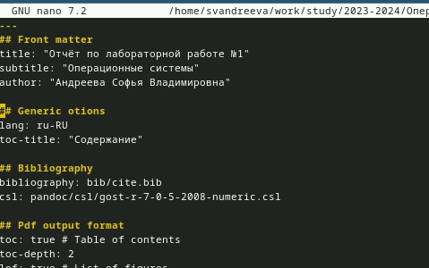
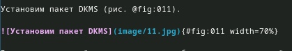
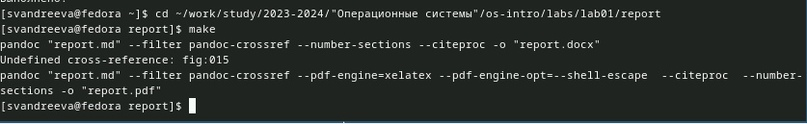

---
## Front matter
title: "Отчёт по лабораторной работе №3"
subtitle: "Операционные системы"
author: "Андреева Софья Владимировна"

## Generic otions
lang: ru-RU
toc-title: "Содержание"

## Bibliography
bibliography: bib/cite.bib
csl: pandoc/csl/gost-r-7-0-5-2008-numeric.csl

## Pdf output format
toc: true # Table of contents
toc-depth: 2
lof: true # List of figures
fontsize: 12pt
linestretch: 1.5
papersize: a4
documentclass: scrreprt
## I18n polyglossia
polyglossia-lang:
  name: russian
  options:
	- spelling=modern
	- babelshorthands=true
polyglossia-otherlangs:
  name: english
## I18n babel
babel-lang: russian
babel-otherlangs: english
## Fonts
mainfont: PT Serif
romanfont: PT Serif
sansfont: PT Sans
monofont: PT Mono
mainfontoptions: Ligatures=TeX
romanfontoptions: Ligatures=TeX
sansfontoptions: Ligatures=TeX,Scale=MatchLowercase
monofontoptions: Scale=MatchLowercase,Scale=0.9
## Biblatex
biblatex: true
biblio-style: "gost-numeric"
biblatexoptions:
  - parentracker=true
  - backend=biber
  - hyperref=auto
  - language=auto
  - autolang=other*
  - citestyle=gost-numeric
## Pandoc-crossref LaTeX customization
figureTitle: "Рис."
listingTitle: "Листинг"
lofTitle: "Список иллюстраций"
lotTitle: "Список таблиц"
lolTitle: "Листинги"
## Misc options
indent: true
header-includes:
  - \usepackage{indentfirst}
  - \usepackage{float} # keep figures where there are in the text
  - \floatplacement{figure}{H} # keep figures where there are in the text
---

# Цель работы

Целью данной работы является приобретение навыков оформления отчётов с помощью легковесного языка разметки Markdown.

# Выполнение лабораторной работы

Оформление шапки  (рис. [-@fig:001]).

{#fig:001 width=70%}

Оформление заголовков (рис. [-@fig:002]).

{#fig:002 width=70%}

Для создания неупорядоченного списка можно использовать зведочки или тире, для упорядоченного - соответствующие цифры.Для многоуровневых списков можно использовать отступы (рис. [-@fig:003]).

[Cозданиe неупорядоченного списка](image/3.jpg){#fig:003 width=70%}

Все изображения, сделанные во время выполнения лабораторной работы сохраняются в специальную папку (рис. [-@fig:004])

[Все изображения](image/4.jpg){#fig:004 width=70%}.

Оформляем изображения (рис. [-@fig:005]).

{#fig:005 width=70%}

После заполнения шаблона сохраняем файл и переходим в терминал. При использовании команды make создаются два дополнительных формата с расширениями .docx и .pdf (рис. [-@fig:006]).

{#fig:006 width=70%}

Выгружаем созданные файлы на GitHub (рис. [-@fig:007]).

{#fig:007 width=70%}

# Выводы

В ходе данной лабораторной работы были приобретены навыки оформления отчётов с помощью легковесного языка разметки Markdown.Были оформлены лабораторные работы 1 и 2.
