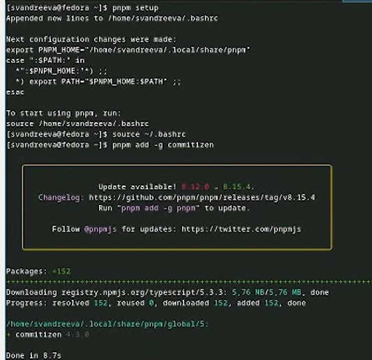
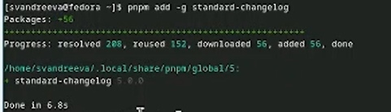
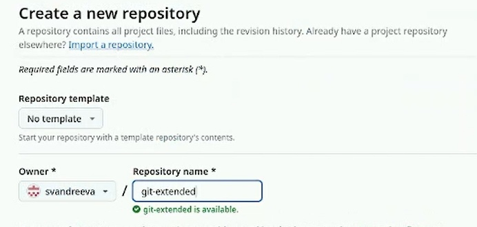
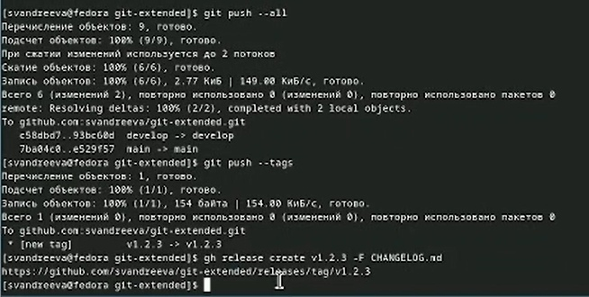

---
## Front matter
lang: ru-RU
title: "Лабораторная работа №4"
subtitle: "Дисциплина: Операционные системы"
author:
- Андреева С.В.
institute:
- Группа НПИбд-01-23
- Российский университет дружбы народов, Москва, Россия

## i18n babel
babel-lang: russian
babel-otherlangs: english

## Formatting pdf
toc: false
toc-title: Содержание
slide_level: 2
aspectratio: 169
section-titles: true
theme: metropolis
header-includes:
- \metroset{progressbar=frametitle,sectionpage=progressbar,numbering=fraction}
- '\makeatletter'
- '\beamer@ignorenonframefalse'
- '\makeatother'

## Fonts
mainfont: PT Serif
romanfont: PT Serif
sansfont: PT Sans
monofont: PT Mono
mainfontoptions: Ligatures=TeX
romanfontoptions: Ligatures=TeX
sansfontoptions: Ligatures=TeX,Scale=MatchLowercase
monofontoptions: Scale=MatchLowercase,Scale=0.9
---

# Информация

## Докладчик

:::::::::::::: {.columns align=center}
::: {.column width="70%"}

* Андреева Софья Владимировна
* Группа НПИбд-01-23
* Российский университет дружбы народов
* [Ссылка на репозиторий GitHub](https://github.com/svandreeva/study_2023-2024_os-intro.git)

:::
::: {.column width="30%"}

:::
::::::::::::::

# Вводная часть

## Цели и задачи

- Получение навыков правильной работы с репозиториями git.

# Выполнение лабораторной работы

## Выполнение работы

Установим git-flow из коллекции репозиториев Cop.

{#fig:001 width=70%}

## Выполнение работы

Установка Node.js.На Node.js базируется программное обеспечение для семантического версионирования и общепринятых коммитов.

{#fig:002 width=70%}

## Выполнение работы

Запустим pnpm setup, выполним source ~/.bashrc.Выполним pnpm add -g commitizen.При этом устанавливается скрипт git-cz, который мы и будем использовать для коммитов .

{#fig:003 width=70%}

## Выполнение работы

Добавим standard-changelog.Данная программа используется для помощи в создании логов.

{#fig:004 width=70%}

## Выполнение работы

Создадим репозиторий на GitHub. Назовём его git-extended.Клонируем его.

{#fig:005 width=70%}

## Выполнение работы

Делаем первый коммит и выкладываем на github.

{#fig:006 width=70%}

## Выполнение работы

Создаем конфигурацию для пакетов Node.js.Необходимо заполнить несколько параметров пакета. Выбираем лицензию CC-BY-4.0.Добавим в файл package.json команду для формирования коммитов.

{#fig:007 width=70%}

## Выполнение работы

Добавим новые файлы, выполним коммит и отправим на github.

{#fig:008 width=70%}

## Выполнение работы

Инициализируем git-flow.Префикс для ярлыков установим в v.Проверим, что мы на ветке develop.Загрузим весь репозиторий в хранилище.

{#fig:009 width=70%}

## Выполнение работы

Установим внешнюю ветку как вышестоящую. Создадим релиз с версией 1.0.0. Создадим журнал изменений. Добавим журнал изменений в индекс. Зальём релизную ветку в основную ветку и отправим данные на github.

{#fig:010 width=70%}

## Выполнение работы

Создадим релиз на github. Для этого будем использовать утилиты работы с github.Создадим ветку для новой функциональности: git flow feature start feature_branch. По окончании разработки новой функциональности следующим шагом следует объединяем ветку feature_branch c develop. Создадим релиз git-flow с версией 1.2.3. Обновим номер версии в файле package.json.

{#fig:011 width=70%}

## Выполнение работы

Создадим журнал изменений. Добавим журнал изменений в индекс. Зальём релизную ветку в основную ветку.

{#fig:012 width=70%}

## Выполнение работы

Отправим данные на github и создадим релиз на github с комментарием из журнала изменений.

{#fig:013 width=70%}

## Вывод

Я получила навыки правильной работы с репозиториями git.
