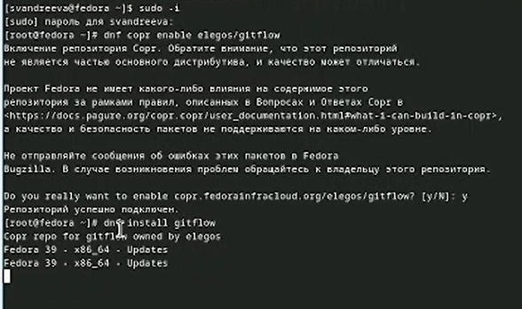
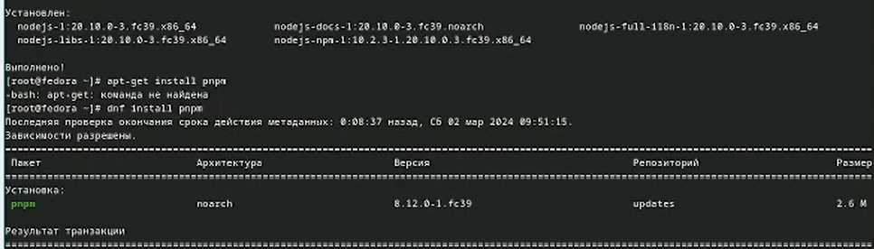
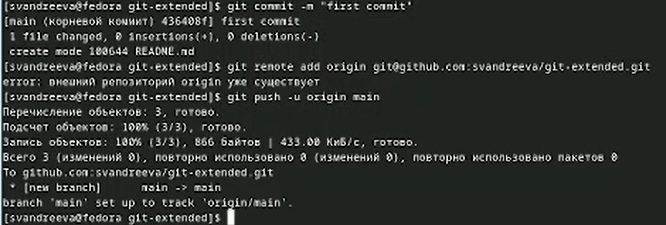
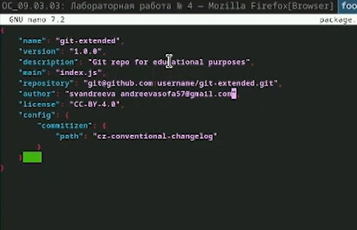
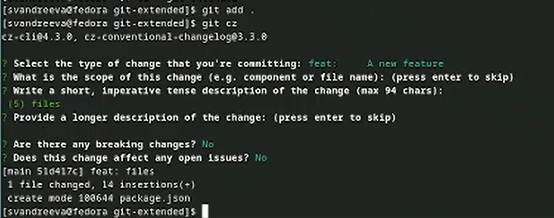
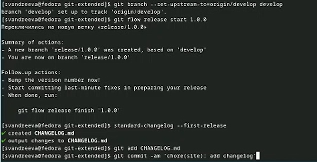
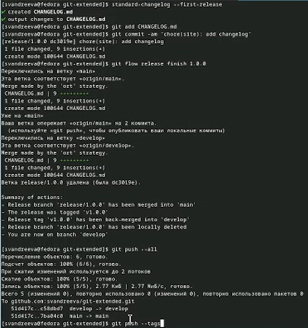
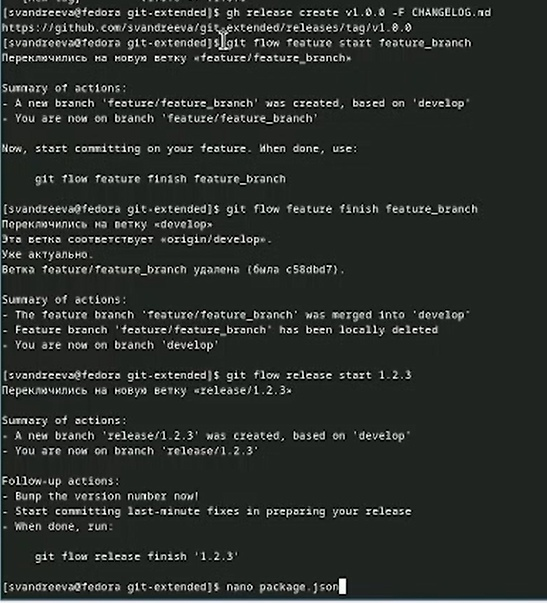
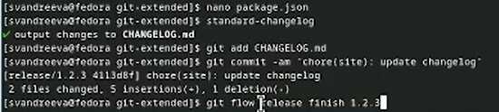

---
## Front matter
title: "Отчёт по лабораторной работе №4"
subtitle: "Операционные системы"
author: "Андреева Софья Владимировна"

## Generic otions
lang: ru-RU
toc-title: "Содержание"

## Bibliography
bibliography: bib/cite.bib
csl: pandoc/csl/gost-r-7-0-5-2008-numeric.csl

## Pdf output format
toc: true # Table of contents
toc-depth: 2
lof: true # List of figures
fontsize: 12pt
linestretch: 1.5
papersize: a4
documentclass: scrreprt
## I18n polyglossia
polyglossia-lang:
name: russian
options:
- spelling=modern
- babelshorthands=true
polyglossia-otherlangs:
name: english
## I18n babel
babel-lang: russian
babel-otherlangs: english
## Fonts
mainfont: PT Serif
romanfont: PT Serif
sansfont: PT Sans
monofont: PT Mono
mainfontoptions: Ligatures=TeX
romanfontoptions: Ligatures=TeX
sansfontoptions: Ligatures=TeX,Scale=MatchLowercase
monofontoptions: Scale=MatchLowercase,Scale=0.9
## Biblatex
biblatex: true
biblio-style: "gost-numeric"
biblatexoptions:
- parentracker=true
- backend=biber
- hyperref=auto
- language=auto
- autolang=other*
- citestyle=gost-numeric
## Pandoc-crossref LaTeX customization
figureTitle: "Рис."
tableTitle: "Таблица"
listingTitle: "Листинг"
lofTitle: "Список иллюстраций"
lolTitle: "Листинги"
## Misc options
indent: true
header-includes:
- \usepackage{indentfirst}
- \usepackage{float} # keep figures where there are in the text
- \floatplacement{figure}{H} # keep figures where there are in the text
---

# Цель работы

Получение навыков правильной работы с репозиториями git.

# Выполнение работы

Установим git-flow из коллекции репозиториев Cop (рис. @fig:001).

{#fig:001 width=70%}

Установка Node.js.На Node.js базируется программное обеспечение для семантического версионирования и общепринятых коммитов (рис. @fig:002).

{#fig:002 width=70%}

Запустим pnpm setup, выполним source ~/.bashrc.Выполним pnpm add -g commitizen.При этом устанавливается скрипт git-cz, который мы и будем использовать для коммитов (рис. @fig:003).

{#fig:003 width=70%}

Добавим standard-changelog.Данная программа используется для помощи в создании логов  (рис. @fig:004).

{#fig:004 width=70%}

Создадим репозиторий на GitHub. Назовём его git-extended.Клонируем его.(рис. @fig:005).

{#fig:005 width=70%}

Делаем первый коммит и выкладываем на github (рис. @fig:006).

{#fig:006 width=70%}

Создаем конфигурацию для пакетов Node.js.Необходимо заполнить несколько параметров пакета. Выбираем лицензию CC-BY-4.0.Добавим в файл package.json команду для формирования коммитов (рис. @fig:007).

{#fig:007 width=70%}

Добавим новые файлы, выполним коммит и отправим на github  (рис. @fig:008).

{#fig:008 width=70%}

Инициализируем git-flow.Префикс для ярлыков установим в v.Проверим, что мы на ветке develop.Загрузим весь репозиторий в хранилище (рис.@fig:009).

{#fig:009 width=70%}

Установим внешнюю ветку как вышестоящую. Создадим релиз с версией 1.0.0. Создадим журнал изменений. Добавим журнал изменений в индекс. Зальём релизную ветку в основную ветку и отправим данные на github (рис. @fig:010).

{#fig:010 width=70%}

Создадим релиз на github. Для этого будем использовать утилиты работы с github.Создадим ветку для новой функциональности: git flow feature start feature_branch. По окончании разработки новой функциональности следующим шагом следует объединяем ветку feature_branch c develop. Создадим релиз git-flow с версией 1.2.3. Обновим номер версии в файле package.json. (рис. @fig:011).

{#fig:011 width=70%}

Создадим журнал изменений. Добавим журнал изменений в индекс. Зальём релизную ветку в основную ветку (рис. @fig:012).

{#fig:012 width=70%}

Отправим данные на github и создадим релиз на github с комментарием из журнала изменений (рис. @fig:013).

{#fig:013 width=70%}

# Выводы

 Я получила навыки правильной работы с репозиториями git.
