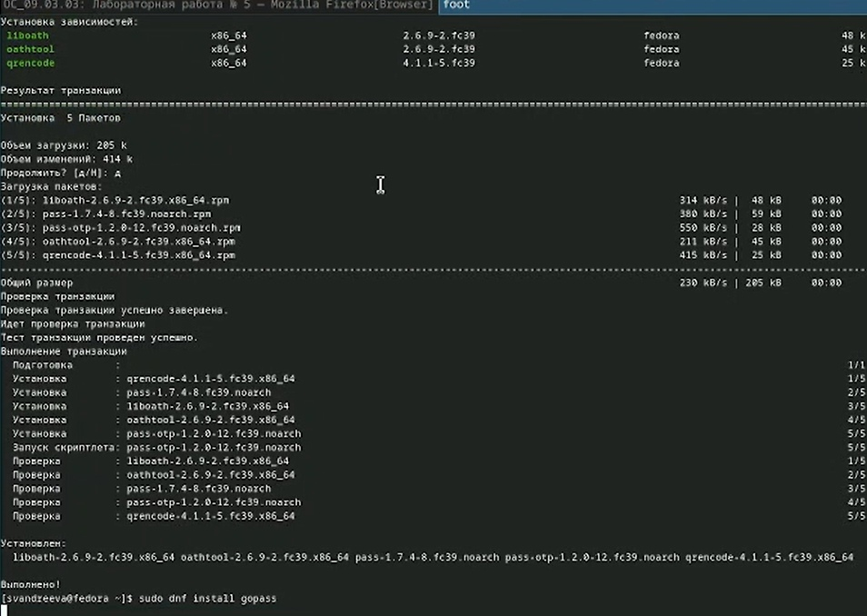
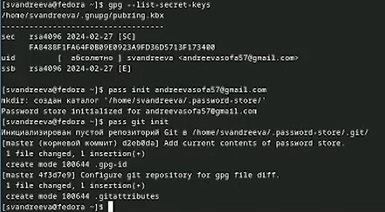
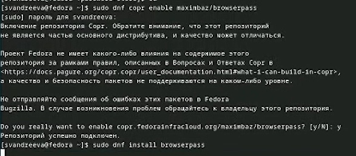
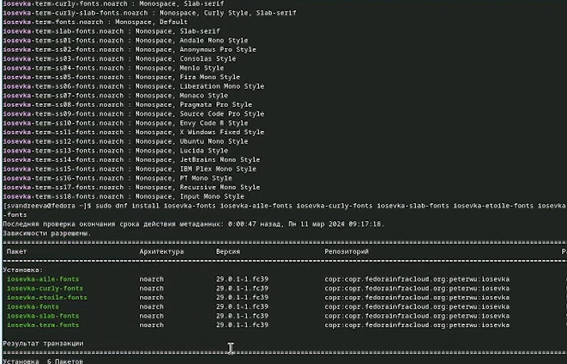
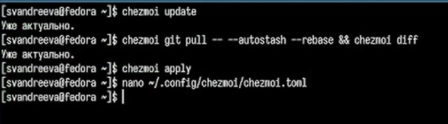

---
## Front matter
lang: ru-RU
title: "Лабораторная работа №5"
subtitle: "Дисциплина: Операционные системы"
author:
- Андреева С.В.
institute:
- Группа НПИбд-01-23
- Российский университет дружбы народов, Москва, Россия

## i18n babel
babel-lang: russian
babel-otherlangs: english

## Formatting pdf
toc: false
toc-title: Содержание
slide_level: 2
aspectratio: 169
section-titles: true
theme: metropolis
header-includes:
- \metroset{progressbar=frametitle,sectionpage=progressbar,numbering=fraction}
- '\makeatletter'
- '\beamer@ignorenonframefalse'
- '\makeatother'

## Fonts
mainfont: PT Serif
romanfont: PT Serif
sansfont: PT Sans
monofont: PT Mono
mainfontoptions: Ligatures=TeX
romanfontoptions: Ligatures=TeX
sansfontoptions: Ligatures=TeX,Scale=MatchLowercase
monofontoptions: Scale=MatchLowercase,Scale=0.9
---

# Информация

## Докладчик

:::::::::::::: {.columns align=center}
::: {.column width="70%"}

* Андреева Софья Владимировна
* Группа НПИбд-01-23
* Российский университет дружбы народов
* [Ссылка на репозиторий GitHub](https://github.com/svandreeva/study_2023-2024_os-intro.git)

:::
::: {.column width="30%"}

:::
::::::::::::::

# Вводная часть

## Цели и задачи

- настроить рабочую среду

# Выполнение лабораторной работы

## Выполнение работы

Устанавливаем менеджер паролей pass.

{#fig:001 width=70%}

## Выполнение работы

Просмотрев список ключей, инициализируем хранилище и создадим структуру git.

{#fig:002 width=70%}

## Выполнение работы

Предварительно создав репозиторий, задаем адрес репозитория на хостинге и синхронизируем.

{#fig:003 width=70%}

## Выполнение работы

Настроим интерфейс с браузером. Скачаем browserpass.

{#fig:004 width=70%}

## Выполнение работы

Добавим новый пароль, отобразим и заменим его.

{#fig:005 width=70%}

## Выполнение работы

Установим дополнительное программное обеспечение и шрифты.

{#fig:006 width=70%}

## Выполнение работы

Установим бинарный файл, создадим свой репозиторий для конфигурационных файлов на основе шаблона.

{#fig:007 width=70%}

## Выполнение работы

Извлечем последние изменения из репозитория и применим их, подключим автоматическую фиксацию.

{#fig:008 width=70%}

## Вывод

B ходе лабораторной работы я настроила свою рабочую среду
