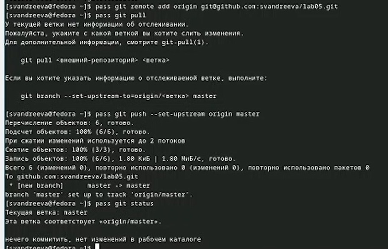
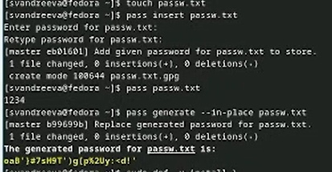
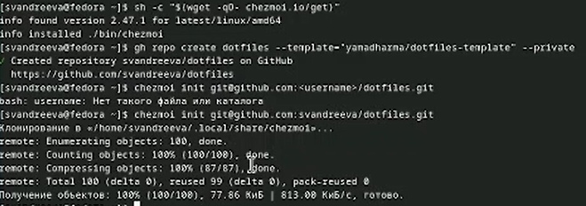

---
## Front matter
title: "Отчёт по лабораторной работе №5"
subtitle: "Операционные системы"
author: "Андреева Софья Владимировна"

## Generic otions
lang: ru-RU
toc-title: "Содержание"

## Bibliography
bibliography: bib/cite.bib
csl: pandoc/csl/gost-r-7-0-5-2008-numeric.csl

## Pdf output format
toc: true # Table of contents
toc-depth: 2
lof: true # List of figures
fontsize: 12pt
linestretch: 1.5
papersize: a4
documentclass: scrreprt
## I18n polyglossia
polyglossia-lang:
name: russian
options:
- spelling=modern
- babelshorthands=true
polyglossia-otherlangs:
name: english
## I18n babel
babel-lang: russian
babel-otherlangs: english
## Fonts
mainfont: PT Serif
romanfont: PT Serif
sansfont: PT Sans
monofont: PT Mono
mainfontoptions: Ligatures=TeX
romanfontoptions: Ligatures=TeX
sansfontoptions: Ligatures=TeX,Scale=MatchLowercase
monofontoptions: Scale=MatchLowercase,Scale=0.9
## Biblatex
biblatex: true
biblio-style: "gost-numeric"
biblatexoptions:
- parentracker=true
- backend=biber
- hyperref=auto
- language=auto
- autolang=other*
- citestyle=gost-numeric
## Pandoc-crossref LaTeX customization
figureTitle: "Рис."
tableTitle: "Таблица"
listingTitle: "Листинг"
lofTitle: "Список иллюстраций"
lolTitle: "Листинги"
## Misc options
indent: true
header-includes:
- \usepackage{indentfirst}
- \usepackage{float} # keep figures where there are in the text
- \floatplacement{figure}{H} # keep figures where there are in the text
---

# Цель работы

Hастроить рабочую среду.

# Выполнение работы

Устанавливаем менеджер паролей pass (рис. @fig:001).

{#fig:001 width=70%}

Просмотрев список ключей, инициализируем хранилище и создадим структуру git (рис. @fig:002).

{#fig:002 width=70%}

Предварительно создав репозиторий, задаем адрес репозитория на хостинге и синхронизируем (рис. @fig:003).

{#fig:003 width=70%}

Настроим интерфейс с браузером. Скачаем browserpass (рис. @fig:004).

{#fig:004 width=70%}

Добавим новый пароль, отобразим и заменим его (рис. @fig:005).

{#fig:005 width=70%}

Установим дополнительное программное обеспечение и шрифты (рис. @fig:006).

{#fig:006 width=70%}

Установим бинарный файл, создадим свой репозиторий для конфигурационных файлов на основе шаблона, подключим репозиторий к своей системе. Проверим, какие изменения внесёт chezmoi в домашний каталог и запустим chezmoi apply  (рис. @fig:007).

{#fig:007 width=70%}

Извлечем последние изменения из репозитория и применим их, подключим автоматическую фиксацию.(рис. @fig:008).

{#fig:008 width=70%}

# Выводы

B ходе лабораторной работы я настроила свою рабочую среду.
