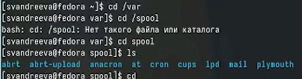
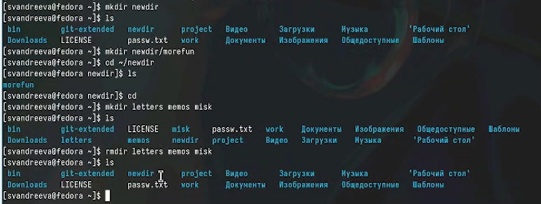
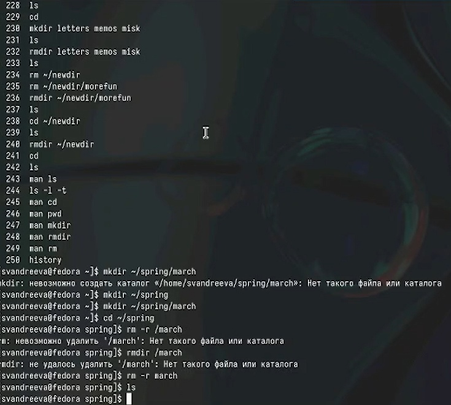

---
## Front matter
lang: ru-RU
title: "Лабораторная работа №6"
subtitle: "Дисциплина: Операционные системы"
author:
- Андреева С.В.
institute:
- Группа НПИбд-01-23
- Российский университет дружбы народов, Москва, Россия

## i18n babel
babel-lang: russian
babel-otherlangs: english

## Formatting pdf
toc: false
toc-title: Содержание
slide_level: 2
aspectratio: 169
section-titles: true
theme: metropolis
header-includes:
- \metroset{progressbar=frametitle,sectionpage=progressbar,numbering=fraction}
- '\makeatletter'
- '\beamer@ignorenonframefalse'
- '\makeatother'

## Fonts
mainfont: PT Serif
romanfont: PT Serif
sansfont: PT Sans
monofont: PT Mono
mainfontoptions: Ligatures=TeX
romanfontoptions: Ligatures=TeX
sansfontoptions: Ligatures=TeX,Scale=MatchLowercase
monofontoptions: Scale=MatchLowercase,Scale=0.9
---

# Информация

## Докладчик

:::::::::::::: {.columns align=center}
::: {.column width="70%"}

* Андреева Софья Владимировна
* Группа НПИбд-01-23
* Российский университет дружбы народов
* [Ссылка на репозиторий GitHub](https://github.com/svandreeva/study_2023-2024_os-intro.git)

:::
::: {.column width="30%"}

:::
::::::::::::::

# Вводная часть

## Цели и задачи

- Приобретение практических навыков взаимодействия пользователя с системой посредством командной строки.

# Выполнение лабораторной работы

## Выполнение работы

Находясь в домашнем каталоге, вывели на экран его полный путь по команде `pwd`.

{#fig:001 width=70%}

## Выполнение работы

Далее перешли в каталог `/tmp` и вывели на экран его содержимое с помощью команды `ls` с различными ключами:ls выводит содержимое каталога, ls -a выводит содержимое каталога и скрытые файлы, ls -alF выводит содержимое каталога, полную информацию о каждом файле, типы файлов и скрытые файлы .

{#fig:002 width=70%}

## Выполнение работы

Далее проверили, есть ли в каталоге `/var/spool` подкаталог `cron` .

{#fig:003 width=70%}

## Выполнение работы

Перешли в домашний каталог, вывели его содержимое с ключом `-l` для определения владельца файлов и каталогов. Владелец - svandreeva.

{#fig:004 width=70%}

## Выполнение работы

Затем в домашнем каталоге создали подкаталог `newdir` и внутри него каталог `morefun`; с помощью одной командый `mkdir letters memos misk` одновременно создали 3 каталога, затем также их удалили `rmdir letters memos misk`.

{#fig:005 width=70%}

## Выполнение работы

При попытке удалить каталог `rm newdir` появляется ошибка и каталог не удаляется. Удаляем каталог `~/newdir/morefun` с помощью команды `rmdir`.

{#fig:006 width=70%}

## Выполнение работы

С помощью `man`, которая выводит на экран справочную информацию о командах, нашли ключ, чтобы вывести содержимое текущего каталога и всех его подкаталогов - `ls -R`.

{#fig:007 width=70%}

## Выполнение работы

Kомбинацию ключей `-l -t` для вывода содержимого каталога c развернутым описанием файлов, отсортированного в порядке уменьшения даты последнего изменения.

{#fig:008 width=70%}

## Выполнение работы

Также с помощью команды `man` получили справочную информацию по следующим командам: cd (рис. @fig:009),pwd,mkdir,rmdir,rm.

{#fig:009 width=70%}

## Выполнение работы

Вызвали команду `history`, которая вывела на экран историю прошлых вызовов команд. Затем модифицировали команды из буфера и выполнили.

{#fig:014 width=70%}

## Выводы

В рамках лабораторной работы получили практические навыки работы с командной строкой: навигация, создание и удаление каталогов, получение справочной информации о необходимых командах.

