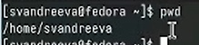
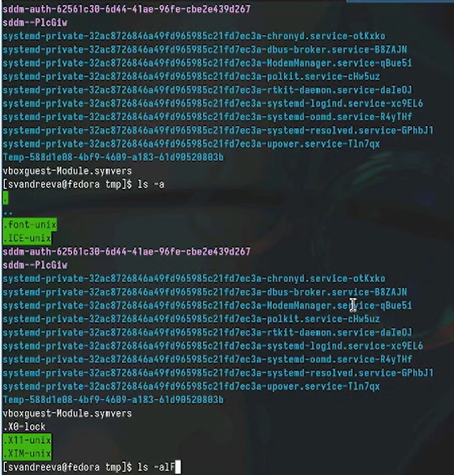
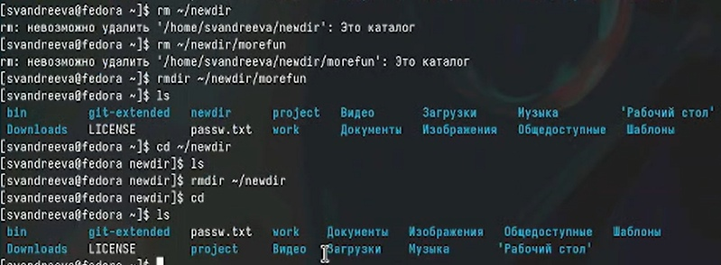
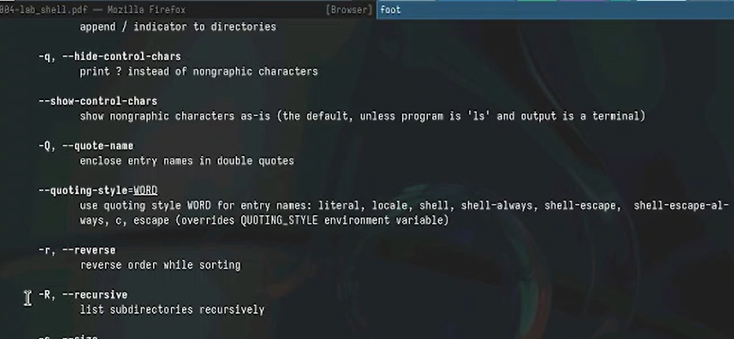
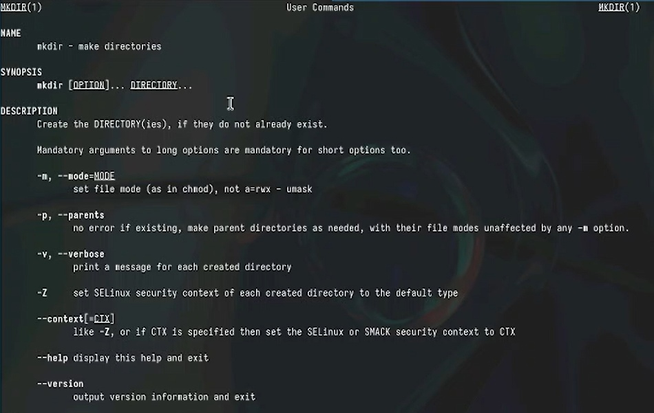

---
## Front matter
title: "Отчёт по лабораторной работе №6"
subtitle: "Операционные системы"
author: "Андреева Софья Владимировна"

## Generic otions
lang: ru-RU
toc-title: "Содержание"

## Bibliography
bibliography: bib/cite.bib
csl: pandoc/csl/gost-r-7-0-5-2008-numeric.csl

## Pdf output format
toc: true # Table of contents
toc-depth: 2
lof: true # List of figures
fontsize: 12pt
linestretch: 1.5
papersize: a4
documentclass: scrreprt
## I18n polyglossia
polyglossia-lang:
name: russian
options:
- spelling=modern
- babelshorthands=true
polyglossia-otherlangs:
name: english
## I18n babel
babel-lang: russian
babel-otherlangs: english
## Fonts
mainfont: PT Serif
romanfont: PT Serif
sansfont: PT Sans
monofont: PT Mono
mainfontoptions: Ligatures=TeX
romanfontoptions: Ligatures=TeX
sansfontoptions: Ligatures=TeX,Scale=MatchLowercase
monofontoptions: Scale=MatchLowercase,Scale=0.9
## Biblatex
biblatex: true
biblio-style: "gost-numeric"
biblatexoptions:
- parentracker=true
- backend=biber
- hyperref=auto
- language=auto
- autolang=other*
- citestyle=gost-numeric
## Pandoc-crossref LaTeX customization
figureTitle: "Рис."
tableTitle: "Таблица"
listingTitle: "Листинг"
lofTitle: "Список иллюстраций"
lolTitle: "Листинги"
## Misc options
indent: true
header-includes:
- \usepackage{indentfirst}
- \usepackage{float} # keep figures where there are in the text
- \floatplacement{figure}{H} # keep figures where there are in the text
---

# Цель работы

Приобретение практических навыков взаимодействия пользователя с системой посредством командной строки.

# Выполнение работы

Находясь в домашнем каталоге, вывели на экран его полный путь по команде `pwd`(рис. @fig:001).

{#fig:001 width=70%}

Далее перешли в каталог `/tmp` и вывели на экран его содержимое с помощью команды `ls` с различными ключами:ls выводит содержимое каталога, ls -a выводит содержимое каталога и скрытые файлы, ls -alF выводит содержимое каталога, полную информацию о каждом файле, типы файлов и скрытые файлы  (рис. @fig:002).

{#fig:002 width=70%}

Далее проверили, есть ли в каталоге `/var/spool` подкаталог `cron` (рис. @fig:003).

{#fig:003 width=70%}

Перешли в домашний каталог, вывели его содержимое с ключом `-l` для определения владельца файлов и каталогов. Владелец  - svandreeva (рис. @fig:004).

{#fig:004 width=70%}

Затем в домашнем каталоге создали подкаталог `newdir` и внутри него каталог `morefun`; с помощью одной командый `mkdir letters memos misk` одновременно создали 3 каталога, затем также их удалили `rmdir letters memos misk`(рис. @fig:005).

{#fig:005 width=70%}

При попытке удалить каталог `rm newdir` появляется ошибка и каталог не удаляется. Удаляем каталог `~/newdir/morefun` с помощью команды `rmdir`(рис. @fig:006).

{#fig:006 width=70%}

С помощью `man`, которая выводит на экран справочную информацию о командах, нашли ключ, чтобы вывести содержимое текущего каталога и всех его подкаталогов - `ls -R`(рис. @fig:007).

{#fig:007 width=70%}

Kомбинацию ключей `-l -t` для вывода содержимого каталога c развернутым описанием файлов, отсортированного в порядке уменьшения даты последнего изменения (рис. @fig:008).

{#fig:008 width=70%}

Также с помощью команды `man` получили справочную информацию по следующим командам: cd (рис. @fig:009), pwd (рис. @fig:010),mkdir(рис. @fig:011),rmdir(рис. @fig:012), rm (рис.@fig:013).

{#fig:009 width=70%}

{#fig:010 width=70%}

{#fig:011 width=70%}

{#fig:012 width=70%}

{#fig:013 width=70%}

Вызвали команду `history`, которая вывела на экран историю прошлых вызовов команд. Затем модифицировали команды из буфера и выполнили (рис. @fig:014).

{#fig:014 width=70%}

# Выводы

В рамках лабораторной работы получили практические навыки работы с командной строкой: навигация, создание и удаление каталогов, получение справочной информации о необходимых командах.
