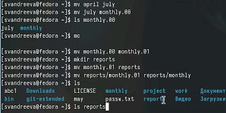
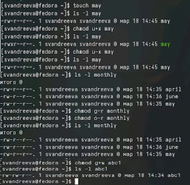
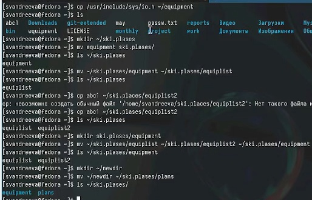
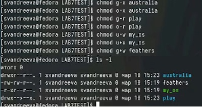
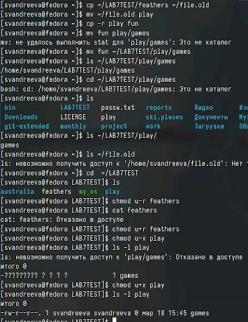

---
## Front matter
lang: ru-RU
title: "Лабораторная работа №7"
subtitle: "Дисциплина: Операционные системы"
author:
- Андреева С.В.
institute:
- Группа НПИбд-01-23
- Российский университет дружбы народов, Москва, Россия

## i18n babel
babel-lang: russian
babel-otherlangs: english

## Formatting pdf
toc: false
toc-title: Содержание
slide_level: 2
aspectratio: 169
section-titles: true
theme: metropolis
header-includes:
- \metroset{progressbar=frametitle,sectionpage=progressbar,numbering=fraction}
- '\makeatletter'
- '\beamer@ignorenonframefalse'
- '\makeatother'

## Fonts
mainfont: PT Serif
romanfont: PT Serif
sansfont: PT Sans
monofont: PT Mono
mainfontoptions: Ligatures=TeX
romanfontoptions: Ligatures=TeX
sansfontoptions: Ligatures=TeX,Scale=MatchLowercase
monofontoptions: Scale=MatchLowercase,Scale=0.9
---

# Информация

## Докладчик

:::::::::::::: {.columns align=center}
::: {.column width="70%"}

* Андреева Софья Владимировна
* Группа НПИбд-01-23
* Российский университет дружбы народов
* [Ссылка на репозиторий GitHub](https://github.com/svandreeva/study_2023-2024_os-intro.git)

:::
::: {.column width="30%"}

:::
::::::::::::::

# Вводная часть

## Цели и задачи

- Ознакомление с файловой системой Linux, её структурой, именами и содержанием каталогов. Приобретение практических навыков по применению команд для работы с файлами и каталогами, по управлению процессами (и работами), по проверке исполь- зования диска и обслуживанию файловой системы.

# Выполнение лабораторной работы

## Выполнение работы

Выполняем все примеры, приведённые в первой части описания лабораторной работы.Скопируем файл ~/abc1 в файл april и в файл maу.г. Скопировать файлы april и may в каталог monthly одной командой.Скопируем файл monthly/may в файл с именем june.Скопируем каталог monthly в каталог monthly.00.Скопируем каталог monthly.00 в каталог /tmp. Проверяем все проведенные команды.

{#fig:001 width=60%}

## Выполнение работы

Изменим название файла april на july в домашнем каталоге.Переместим файл july в каталог monthly.00. Переименуем каталог monthly.00 в monthly.01.г.Переместим каталог monthly.01 в каталог reports. Переименуем каталог reports/monthly.01 в reports/monthly.Проверяем результаты проведенных команд.

{#fig:002 width=60%}

## Выполнение работы

Создаем файл ~/may с правом выполнения для владельца.Лишаем владельца файла ~/may права на выполнение.Создаем каталог monthly с запретом на чтение для членов группы и всех остальных пользователей.Требуется создать файл ~/abc1 с правом записи для членов группы.

{#fig:003 width=60%}

## Выполнение работы

Скопируем файл /usr/include/sys/io.h в домашний каталог и назовем его equipment.В домашнем каталоге создадим директорию ~/ski.plases, переместим туда файл equipment.Переименуем файл ~/ski.plases/equipment в ~/ski.plases/equiplist.Файл abc1 скопируем в каталог ~/ski.plases, назовем его equiplist2.Создадим каталог с именем equipment в каталоге ~/ski.plases, переместим туда файлы ~/ski.plases/equiplist и equiplist2.Создадим и переместим каталог ~/newdir в каталог ~/ski.plases и назовем его plans.

{#fig:004 width=60%}

## Выполнение работы

Определим опции команды chmod, необходимые для того, чтобы присвоить предварительно созданным файлам заданные нам права доступа.

{#fig:005 width=60%}

## Выполнение работы

- Просмотрели содержимое файла /etc/password с помащью команды cat.
- Скопируем файл ~/feathers в файл ~/file.old.Переместите файл ~/file.old в каталог ~/play.Скопируем каталог ~/play в каталог ~/fun.Переместим каталог ~/fun в каталог ~/play и назовем его games.
- Лишим владельца файла ~/feathers права на чтение.Попытавшись просмотреть файл ~/feathers командой cat, мы получили отказ в доступе.Попытавшись скопировать файл ~/feathers, мы получили отказ в доступе.Дадим владельцу файла ~/feathers право на чтение.
- Лишим владельца каталога ~/play права на выполнение.Перейдя в каталог ~/play,получили отказ в доступе, вся информация скрыта вопросительными знаками.Дадим владельцу каталога ~/play право на выполнение..

## Выполнение работы

{#fig:006 width=55%}

## Выполнение работы

Прочитали man по командам mount, fsck, mkfs, kill.

{#fig:007 width=60%}

## Вывод

В ходе выполнения этой лабораторной я ознакомилась с файловой системой Linux, её структурой, именами и содержанием каталогов. Приобрела практические навыки по применению команд для работы с файлами и каталогами, по управлению процессами (и работами), по проверке использования диска и обслуживанию файловой системы.
