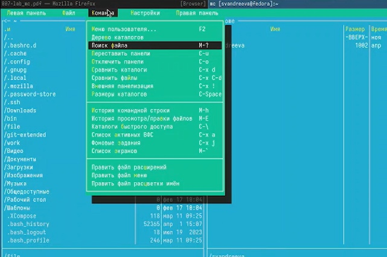
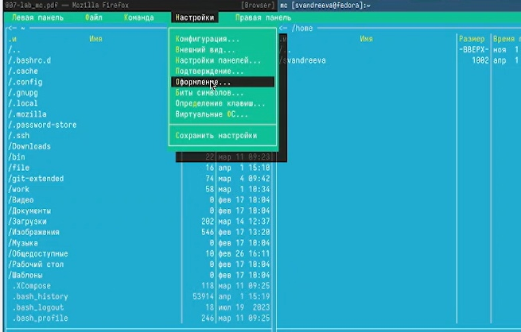

---
## Front matter
lang: ru-RU
title: "Лабораторная работа №9"
subtitle: "Дисциплина: Операционные системы"
author:
- Андреева С.В.
institute:
- Группа НПИбд-01-23
- Российский университет дружбы народов, Москва, Россия

## i18n babel
babel-lang: russian
babel-otherlangs: english

## Formatting pdf
toc: false
toc-title: Содержание
slide_level: 2
aspectratio: 169
section-titles: true
theme: metropolis
header-includes:
- \metroset{progressbar=frametitle,sectionpage=progressbar,numbering=fraction}
- '\makeatletter'
- '\beamer@ignorenonframefalse'
- '\makeatother'

## Fonts
mainfont: PT Serif
romanfont: PT Serif
sansfont: PT Sans
monofont: PT Mono
mainfontoptions: Ligatures=TeX
romanfontoptions: Ligatures=TeX
sansfontoptions: Ligatures=TeX,Scale=MatchLowercase
monofontoptions: Scale=MatchLowercase,Scale=0.9
---

# Информация

## Докладчик

:::::::::::::: {.columns align=center}
::: {.column width="70%"}

* Андреева Софья Владимировна
* Группа НПИбд-01-23
* Российский университет дружбы народов
* [Ссылка на репозиторий GitHub](https://github.com/svandreeva/study_2023-2024_os-intro.git)

:::
::: {.column width="30%"}

:::
::::::::::::::

# Вводная часть

## Цели и задачи

- Освоение основных возможностей командной оболочки Midnight Commander. Приобретение навыков практической работы по просмотру каталогов и файлов; манипуляций с ними.

# Выполнение лабораторной работы

## Выполнение работы.Задание по mc

Изучим информацию о mc, вызвав в командной строке man mc.

{#fig:001 width=60%}

## Выполнение работы

Запустим из командной строки mc, изучим его структуру и меню.Выполним несколько операций в mc, используя управляющие клавиши F5 и F6 - копирование/перемещение файлов .

{#fig:002 width=60%}

## Выполнение работы

Выполним основные команды меню левой панели.

{#fig:003 width=60%}

## Выполнение работы

Используя возможности подменю Файл, выполним :
- просмотр содержимого текстового файла;
- редактирование содержимого текстового файла (без сохранения результатов редактирования)
- создание каталога;
- копирование в файлов в созданный каталог.

{#fig:004 width=55%}

## Выполнение работы

С помощью соответствующих средств подменю Команда осуществим:
- поиск в файловой системе файла с заданными условиями (например, файла с расширением .c или .cpp, содержащего строку main);
- выбор и повторение одной из предыдущих команд;
- переход в домашний каталог;
- анализ файла меню и файла расширений.

{#fig:005 width=55%}

## Выполнение работы

Вызовем подменю Настройки. Освоим операции, определяющие структуру экрана mc (Full screen, Double Width, Show Hidden Files и т.д.).

{#fig:006 width=60%}

## Задание по встроенному редактору mc

Создадим текстовой файл text.txt, откроем его с помощью встроенного в mc.

Вставьте в открытый файл небольшой фрагмент текста, скопированный из любого
другого файла или Интернета.

`Insert`
	
Проделайте с текстом следующие манипуляции, используя горячие клавиши:

Удалите строку текста.

`Ctrl-y`
	
Выделите фрагмент текста и скопируйте его на новую строку.
		
`F3 -F5`
	
Выделите фрагмент текста и перенесите его на новую строку.

`F3 - F6`

## Выполнение работы
	
Сохраните файл.

`F2`
	
Отмените последнее действие.

`Ctrl+u`

Перейдите в конец файла (нажав комбинацию клавиш) и напишите некоторый текст.

`Ctrl+X`
	
Перейдите в начало файла (нажав комбинацию клавиш) и напишите некоторый текст.
		
`Ctrl+Z`	

## Выполнение работы
	
Сохраните и закройте файл.
		
`F2 - F10`

{#fig:007 width=70%}

## Выполнение работы

Откроем файл с исходным текстом на некотором языке программирования.Используя меню редактора, включим подсветку синтаксиса (рис. @fig:008).

{#fig:008 width=70%}

## Вывод

В ходе работы были изучены основные возможности командной оболочки Midnight Commander, приобретены навыки практической работы по просмотру каталогов и файлов; манипуляций с ними.
