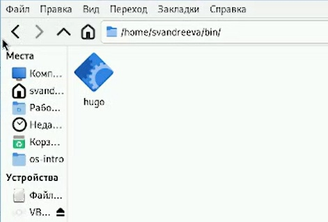
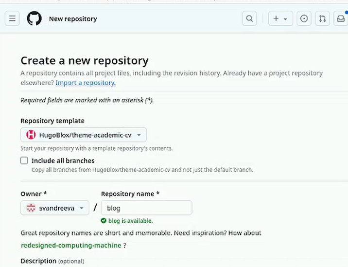
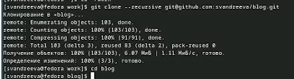
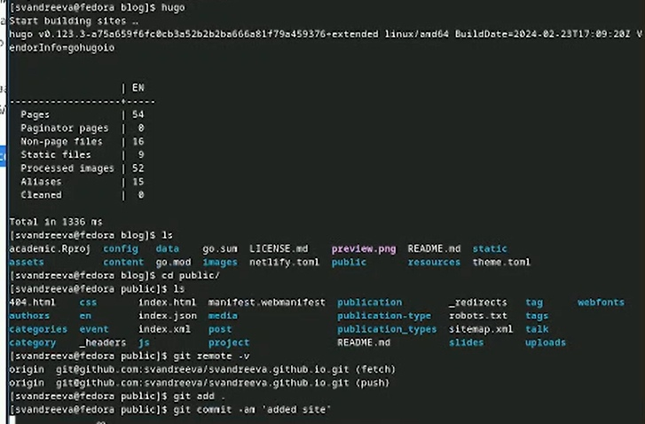

---
## Front matter
lang: ru-RU
title: "Отчёт о выполнении. Индивидуальный проект. Этап 1"
subtitle: "Дисциплина: Операционные системы"
author:
  - Андреева С.В.
institute:
  - Группа НПИбд-01-23
  - Российский университет дружбы народов, Москва, Россия

## i18n babel
babel-lang: russian
babel-otherlangs: english

## Formatting pdf
toc: false
toc-title: Содержание
slide_level: 2
aspectratio: 169
section-titles: true
theme: metropolis
header-includes:
 - \metroset{progressbar=frametitle,sectionpage=progressbar,numbering=fraction}
 - '\makeatletter'
 - '\beamer@ignorenonframefalse'
 - '\makeatother'

## Fonts
mainfont: PT Serif
romanfont: PT Serif
sansfont: PT Sans
monofont: PT Mono
mainfontoptions: Ligatures=TeX
romanfontoptions: Ligatures=TeX
sansfontoptions: Ligatures=TeX,Scale=MatchLowercase
monofontoptions: Scale=MatchLowercase,Scale=0.9
---

# Информация

## Докладчик

:::::::::::::: {.columns align=center}
::: {.column width="70%"}

  * Андреева Софья Владимировна
  * Группа НПИбд-01-23
  * Российский университет дружбы народов
  * [Ссылка на репозиторий GitHub](https://github.com/svandreeva/study_2023-2024_os-intro.git) 

:::
::: {.column width="30%"}

:::
::::::::::::::

# Вводная часть

## Цели и задачи

- Установить необходимое программное обеспечение.
- Скачать шаблон темы сайта.
- Разместить его на хостинге git.
- Установить параметр для URLs сайта.
- Разместить заготовку сайта на Github pages.

## Выполнение 

Установим программное обеспечение для Hugo.Разархивируем скачанный архив и сам hugo переместим в созданную в домашнем каталоге bin.

{#fig:001 width=70%}

##  Выполнение 

Создадим репозиторий blog на основе шаблона.

{#fig:002 width=70%}

##  Выполнение 

Клонируем созданный репозиторий.

{#fig:003 width=70%}

##  Выполнение 

Введем команду ~/bin/hugo, создадутся необходимые папки из них удаляем папку public, так как она нам не нужна.

{#fig:004 width=70%}

##  Выполнение 

Введем команду ~/bin/hugo server.Консоль выдает ссылку на сайт, переходим и проверяем его.

{#fig:005 width=60%}

##  Выполнение 

Создадим новый репозиторий с определенным именем.

{#fig:006 width=70%}

##  Выполнение 

Kлонируем репозиторий и выгрузим в него созданный файл README.md, проверяем наличие файла в репозитории.

{#fig:007 width=60%}

##  Выполнение 

Редактируем gitignore, тем самым отключаем public.

{#fig:008 width=65%}

##  Выполнение 

Подключаем репозиторий к вложенной папке.

{#fig:009 width=60%}

##  Выполнение 

Генерируем сайт и выгружаем все на сервер.

{#fig:010 width=60%}

## Вывод

Я установила необходимое программное обеспечение.Скачала шаблон темы сайта.Разместила его на хостинге git.Установила параметр для URLs сайта.Разместила заготовку сайта на Github pages.
