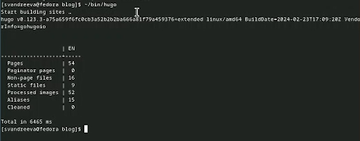
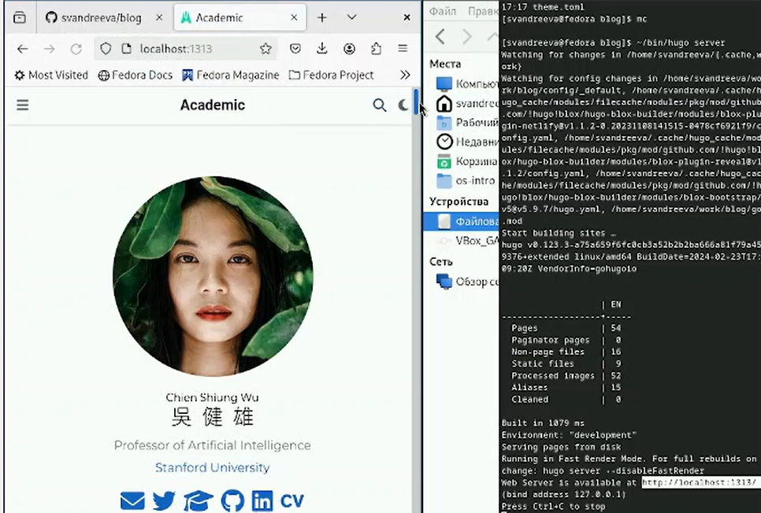
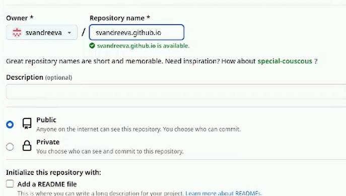
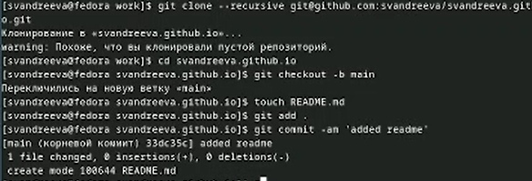
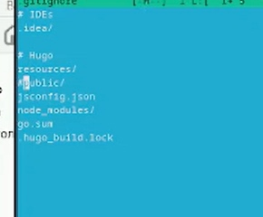
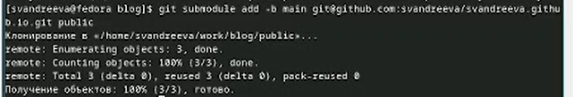

---
## Front matter
title: "Отчёт о выполнении. Индивидуальный проект. Этап 1"
subtitle: "Операционные системы"
author: "Андреева Софья Владимировна"

## Generic otions
lang: ru-RU
toc-title: "Содержание"

## Bibliography
bibliography: bib/cite.bib
csl: pandoc/csl/gost-r-7-0-5-2008-numeric.csl

## Pdf output format
toc: true # Table of contents
toc-depth: 2
lof: true # List of figures
fontsize: 12pt
linestretch: 1.5
papersize: a4
documentclass: scrreprt
## I18n polyglossia
polyglossia-lang:
name: russian
options:
- spelling=modern
- babelshorthands=true
polyglossia-otherlangs:
name: english
## I18n babel
babel-lang: russian
babel-otherlangs: english
## Fonts
mainfont: PT Serif
romanfont: PT Serif
sansfont: PT Sans
monofont: PT Mono
mainfontoptions: Ligatures=TeX
romanfontoptions: Ligatures=TeX
sansfontoptions: Ligatures=TeX,Scale=MatchLowercase
monofontoptions: Scale=MatchLowercase,Scale=0.9
## Biblatex
biblatex: true
biblio-style: "gost-numeric"
biblatexoptions:
- parentracker=true
- backend=biber
- hyperref=auto
- language=auto
- autolang=other*
- citestyle=gost-numeric
## Pandoc-crossref LaTeX customization
figureTitle: "Рис."
tableTitle: "Таблица"
listingTitle: "Листинг"
lofTitle: "Список иллюстраций"
lolTitle: "Листинги"
## Misc options
indent: true
header-includes:
- \usepackage{indentfirst}
- \usepackage{float} # keep figures where there are in the text
- \floatplacement{figure}{H} # keep figures where there are in the text
---

# Цель и задачи  работы

- Установить необходимое программное обеспечение.
- Скачать шаблон темы сайта.
- Разместить его на хостинге git.
- Установить параметр для URLs сайта.
- Разместить заготовку сайта на Github pages.

# Выполнение работы

Установим программное обеспечение для Hugo.Разархивируем скачанный архив и сам hugo переместим в созданную в домашнем каталоге папку bin  (рис. [-@fig:001]).

{#fig:001 width=70%}

Создадим репозиторий blog на основе шаблона (рис. [-@fig:002]).

{#fig:002 width=70%}

Клонируем созданный репозиторий (рис. [-@fig:003]).

{#fig:003 width=70%}

Введем команду ~/bin/hugo, создадутся необходимые папки из них удаляем папку public, так как она нам не нужна (рис. [-@fig:004]).

{#fig:004 width=70%}

Введем команду ~/bin/hugo server.Консоль выдает ссылку на сайт, переходим и проверяем его (рис. [-@fig:005]).

{#fig:005 width=70%}

Создадим новый репозиторий с определенным именем (рис. [-@fig:006]).

{#fig:006 width=70%}

Kлонируем репозиторий и выгрузим в него созданный файл README.md, проверяем наличие файла в репозитории  (рис. [-@fig:007]).

{#fig:007 width=70%}
 
Редактируем gitignore, тем самым отключаем public (рис. [-@fig:008]).

{#fig:008 width=70%}

Подключаем репозиторий к вложенной папке (рис. [-@fig:009]).

{#fig:009 width=70%}

Генерируем сайт и выгружаем все на сервер (рис. [-@fig:010]).

{#fig:010 width=70%}

# Вывод

Я установила необходимое программное обеспечение.Скачала шаблон темы сайта.Разместила его на хостинге git.Установила параметр для URLs сайта.Разместила заготовку сайта на Github pages.
