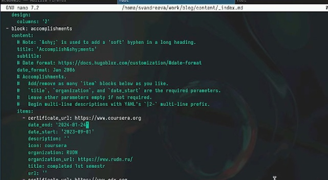
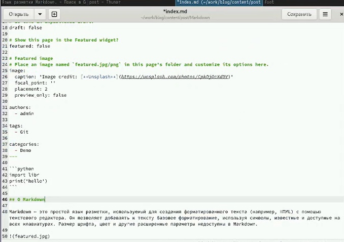

---
## Front matter
lang: ru-RU
title: "Отчёт о выполнении. Индивидуальный проект. Этап 3"
subtitle: "Дисциплина: Операционные системы"
author:
  - Андреева С.В.
institute:
  - Группа НПИбд-01-23
  - Российский университет дружбы народов, Москва, Россия

## i18n babel
babel-lang: russian
babel-otherlangs: english

## Formatting pdf
toc: false
toc-title: Содержание
slide_level: 2
aspectratio: 169
section-titles: true
theme: metropolis
header-includes:
 - \metroset{progressbar=frametitle,sectionpage=progressbar,numbering=fraction}
 - '\makeatletter'
 - '\beamer@ignorenonframefalse'
 - '\makeatother'

## Fonts
mainfont: PT Serif
romanfont: PT Serif
sansfont: PT Sans
monofont: PT Mono
mainfontoptions: Ligatures=TeX
romanfontoptions: Ligatures=TeX
sansfontoptions: Ligatures=TeX,Scale=MatchLowercase
monofontoptions: Scale=MatchLowercase,Scale=0.9
---

# Информация

## Докладчик

:::::::::::::: {.columns align=center}
::: {.column width="70%"}

  * Андреева Софья Владимировна
  * Группа НПИбд-01-23
  * Российский университет дружбы народов

:::
::: {.column width="30%"}

:::
::::::::::::::

# Вводная часть

## Цели и задачи

- Добавить к сайту достижения.
- Добавить информацию о навыках (Skills).
- Добавить информацию об опыте (Experience).
- Добавить информацию о достижениях (Accomplishments).
- Сделать пост по прошедшей неделе.
- Добавить пост на тему по выбору: Легковесные языки разметки./Языки разметки. LaTeX./Язык разметки Markdown.

## Выполнение 

В начале я зашла в папку blog/content/_index.md. Там я нашла картинку, которую заменила на свою, и текстовый файл на языке разметки, в котором тоже было необходимо произвести изменения. Я изменила данные на свои и написала небольшой абзац о своих достижениях и интересах.Добавила информацию об опыте (Experience) и о достижениях (Accomplishments).(

{#fig:001 width=50%}

## Выполнение 

{#fig:002 width=70%}

## Выполнение 

{#fig:003 width=70%}

## Выполнение 

Чтобы сделать пост по прошедшей неделе, необходимо было зайти в папку blog/content/post, создать новую папку и написать пост в index.md, который находится в созданной папке 

{#fig:004 width=70%}

## Выполнение 

Аналогично добавила пост на тему по выбору - язык разметки Markdown. 

{#fig:005 width=70%}

## Вывод

- Добавить к сайту достижения.
- Добавить информацию о навыках (Skills).
- Добавить информацию об опыте (Experience).
- Добавить информацию о достижениях (Accomplishments).
- Сделать пост по прошедшей неделе.
- Добавить пост на тему по выбору: Легковесные языки разметки./Языки разметки. LaTeX./Язык разметки Markdown.
