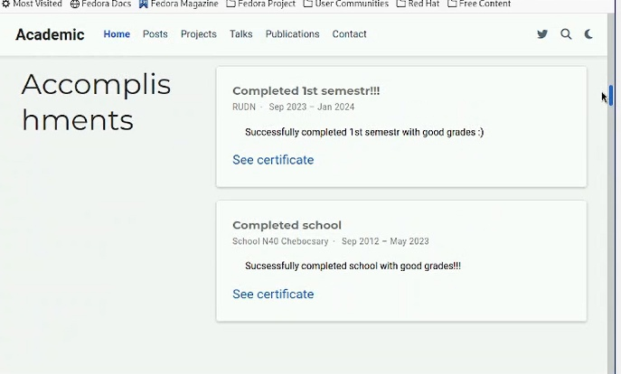
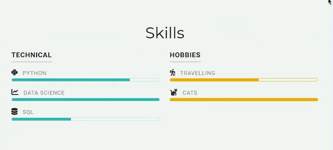
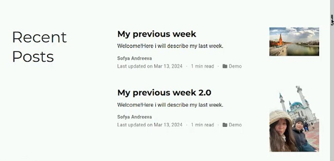

---
## Front matter
title: "Отчёт о выполнении. Индивидуальный проект. Этап 3"
subtitle: "Операционные системы"
author: "Андреева Софья Владимировна"

## Generic otions
lang: ru-RU
toc-title: "Содержание"

## Bibliography
bibliography: bib/cite.bib
csl: pandoc/csl/gost-r-7-0-5-2008-numeric.csl

## Pdf output format
toc: true # Table of contents
toc-depth: 2
lof: true # List of figures
fontsize: 12pt
linestretch: 1.5
papersize: a4
documentclass: scrreprt
## I18n polyglossia
polyglossia-lang:
name: russian
options:
- spelling=modern
- babelshorthands=true
polyglossia-otherlangs:
name: english
## I18n babel
babel-lang: russian
babel-otherlangs: english
## Fonts
mainfont: PT Serif
romanfont: PT Serif
sansfont: PT Sans
monofont: PT Mono
mainfontoptions: Ligatures=TeX
romanfontoptions: Ligatures=TeX
sansfontoptions: Ligatures=TeX,Scale=MatchLowercase
monofontoptions: Scale=MatchLowercase,Scale=0.9
## Biblatex
biblatex: true
biblio-style: "gost-numeric"
biblatexoptions:
- parentracker=true
- backend=biber
- hyperref=auto
- language=auto
- autolang=other*
- citestyle=gost-numeric
## Pandoc-crossref LaTeX customization
figureTitle: "Рис."
tableTitle: "Таблица"
listingTitle: "Листинг"
lofTitle: "Список иллюстраций"
lolTitle: "Листинги"
## Misc options
indent: true
header-includes:
- \usepackage{indentfirst}
- \usepackage{float} # keep figures where there are in the text
- \floatplacement{figure}{H} # keep figures where there are in the text
---

# Цель и задачи  работы

- Добавить к сайту достижения.
- Добавить информацию о навыках (Skills).
- Добавить информацию об опыте (Experience).
- Добавить информацию о достижениях (Accomplishments).
- Сделать пост по прошедшей неделе.
- Добавить пост на тему по выбору:
- Легковесные языки разметки.
- Языки разметки. LaTeX.
- Язык разметки Markdown.

# Выполнение работы

В начале я зашла в папку blog/content/_index.md. Там я нашла картинку, которую заменила на свою, и текстовый файл на языке разметки, в котором тоже было необходимо произвести изменения. Я изменила данные на свои и написала небольшой абзац о своих достижениях и интересах.Добавила информацию об опыте (Experience) и о достижениях (Accomplishments).(рис. [-@fig:001]),(рис. [-@fig:002]),(рис. [-@fig:003]).

{#fig:001 width=70%}

{#fig:002 width=70%}

{#fig:003 width=70%}

Чтобы сделать пост по прошедшей неделе, необходимо было зайти в папку blog/content/post, создать новую папку и написать пост в index.md, который находится в созданной папке (рис. [-@fig:004]).

{#fig:004 width=70%}

Аналогично добавила пост на тему по выбору - язык разметки Markdown. (рис. [-@fig:005]).

{#fig:005 width=70%}
 
# Вывод

Добавили к сайту данные о себе.
